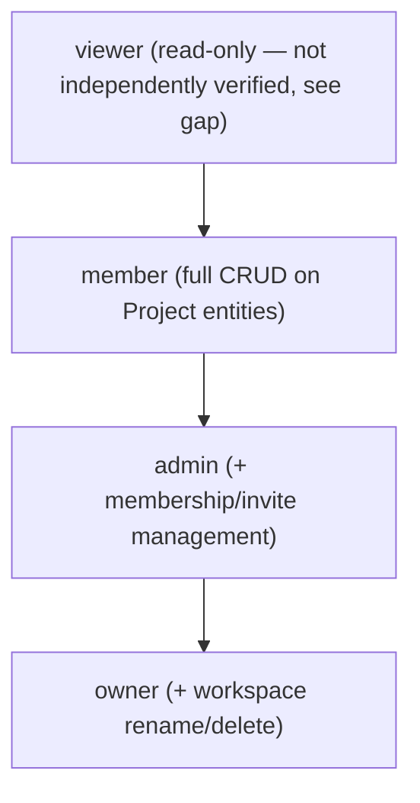

# Bunkai TMS — User Personas

> Generated: 2026-08-14 by `/project-discovery` Phase 2, PRD sub-step 2.
> Method: personas = the system roles the authorization code recognizes, not invented demographics. Source: `workspace_members.role` CHECK constraint (`supabase/migrations/0001_tenancy.sql`), `lib/api/principal.ts` (`Principal.via` = `cookie`/`bearer`), `runs.executor_mode` CHECK (`human`/`agent`/`ci`, `0031_runs.sql`).
> **Discrepancy notice**: the target's own internal `.context/PRD/user-personas.md` documents four named, demographically-detailed personas (Elena, Mateo, Sara, Karim) with invented biography, geography, and quotes. That document is aspirational persona-marketing material, not reverse-engineered from the code's actual authorization model. This document instead documents the roles the schema and middleware structurally recognize. Cross-referenced below where the aspirational personas map onto real roles.

---

## Persona Discovery Summary

| Persona | System Role | Access Level | Primary Goal |
|---|---|---|---|
| Workspace Member (QA Engineer) | `member` (workspace_members.role) | Full CRUD on Modules, User Stories, ACs, ATCs, Tests, Runs within workspaces they belong to | Author and execute the test suite |
| Workspace Owner/Admin (QA Lead) | `owner` / `admin` (workspace_members.role) | Everything `member` can do, plus membership management, invites, and (owner only) workspace mutation/deletion | Govern workspace membership and structure; oversee coverage |
| Headless/Agent Caller (PAT) | Any `workspace_members.role`, authenticated via Bearer PAT instead of cookie | Same RLS-gated data access as the underlying user, but explicitly capability-scoped (`atc:read`, `atc:write`, `run:execute`, `workspace:admin`) | Drive ATC authoring or Run execution from CI/automation without a browser session |

*(A fourth role, `viewer`, exists in the same CHECK constraint but no route-level or component-level evidence of a distinct read-only UI/enforcement path was found in this pass — see Discovery Gaps. It is not promoted to a full persona per the "fewer is better" quality rule.)*

---

## Persona 1 — Workspace Member (QA Engineer)

### Identity

- **System Role**: `member` — `workspace_members.role = 'member'`
- **Evidence file**: `supabase/migrations/0001_tenancy.sql` (role CHECK); route-level RLS enforcement across `app/api/v1/{modules,user-stories,acceptance-criteria,atcs,tests,runs}/**`
- **Access Level**: Full CRUD on Project-scoped entities (Modules, User Stories, Acceptance Criteria, ATCs, Tests, Runs) within workspaces where an `active` membership row exists. Cannot manage other members' roles or invites (admin/owner-gated per `business-api-map.md` §2 "Where enforcement lives in code").
- **Estimated % of Users**: Majority — this is the default role new invites resolve to unless explicitly elevated (Source: `lib/workspaces/invites.ts` `ROLE_RANK` comparison logic).

### Goals (Inferred from Features)

| Goal | Supporting Feature | Route/Component |
|---|---|---|
| Build a Module tree mirroring the app under test | Module CRUD + move/reparent (max depth 6) | `POST/PATCH/DELETE /api/v1/modules/[id]`, `supabase/migrations/0002_projects_modules.sql`, `0015_module_move.sql` |
| Author reusable, AC-anchored test units | ATC create/edit/duplicate/search | `app/(app)/projects/[projectSlug]/atcs/**`, `supabase/migrations/0004_atcs.sql` |
| Assemble ATCs into an ordered, reusable Test | Test create + reorder | `app/(app)/projects/[projectSlug]/tests/**`, `supabase/migrations/0024_tests.sql`, `0026_tests_reorder.sql` |
| Execute a Test against a target environment and record the result | Run create/execute/abort/finish | `app/(app)/projects/[projectSlug]/runs/[runId]/page.tsx`, `supabase/migrations/0031_runs.sql`, `0036_run_abort.sql`, `0037_run_finish.sql` |

### Pain Points (Inferred from Validation/Errors)

| Pain Point | Evidence |
|---|---|
| Test chain rejected if empty | `chain_empty`, SQLSTATE `45120` — `supabase/migrations/0024_tests.sql` lines 203–206 |
| ATC referencing a foreign-workspace resource collapses to one uniform, non-disclosing error | `atc_not_in_workspace`, SQLSTATE `45122` — `0024_tests.sql` lines 208–225 |
| A Run cannot start without at least one executable step, or against an environment outside the Test's project | `no_executable_steps` / `environment_invalid` error codes — `lib/api/error-envelope.ts` |
| A finished/aborted Run rejects a second finish attempt (race on concurrent finish) | `run_not_finishable`, SQLSTATE `45206` — `supabase/migrations/0037_run_finish.sql` lines 39–43 |

### Feature Access

| Feature | Access | Evidence |
|---|---|---|
| Modules/Stories/ACs/ATCs/Tests/Runs CRUD | Full | RLS: active member of workspace — `supabase/migrations/0001_tenancy.sql` policy pattern replicated per-table |
| Workspace membership management (invites, role changes) | None | Admin/owner-gated per `business-api-map.md` §2 |
| Workspace deletion / plan changes | None | Owner-only (`workspaces_update_owner`/`_delete_owner` RLS policies, `0001_tenancy.sql`) |
| Personal Access Token issuance | Full (for self) | `app/api/v1/tokens/**`, `lib/api/pat.ts` |

### User Journey Summary (one-line ASCII flow)

```
Sign in -> pick Workspace -> build Module tree -> author ATCs -> assemble Test -> start Run -> record step results -> finish Run
```

### Profile Attributes (from User model schema)

`auth.users` (Supabase-managed) joined to `workspace_members(workspace_id, user_id, role, status, joined_at)`. No additional profile fields (name, avatar, timezone) were found in a custom `profiles`/`users` table in the migrations read this pass — flagged as Discovery Gap.

### Representative Quote (inferred)

> "I need every ATC I write to prove it covers a real acceptance criterion — not just live in a folder somewhere." *(inferred from the anchoring-moat design, not a real user statement)*

---

## Persona 2 — Workspace Owner / Admin (QA Lead)

### Identity

- **System Role**: `owner` (workspace creator, `workspaces.owner_user_id`) and `admin` (elevated `workspace_members.role`)
- **Evidence file**: `supabase/migrations/0001_tenancy.sql` — `workspaces_update_owner`/`workspaces_delete_owner` RLS policies gate mutation/deletion to `role = 'owner'`; invite issuance is admin/owner-gated per `business-api-map.md` §2
- **Access Level**: Everything a `member` can do, plus: issue/revoke/resend workspace invites, manage member roles, and (owner only) rename/delete the workspace
- **Estimated % of Users**: Minority — one `owner` per workspace by construction (`workspaces.owner_user_id` not-null FK), plus however many `admin`-role members exist

### Goals (Inferred from Features)

| Goal | Supporting Feature | Route/Component |
|---|---|---|
| Stand up a new isolated workspace for the team | `bunkai_bootstrap_workspace` RPC, auto-enrolls creator as owner | `POST /api/v1/workspaces` |
| Bring teammates in with the right access level | Invite by email+role, accept/resend/revoke | `POST/GET/DELETE /api/v1/workspaces/{id}/invites`, `app/(app)/workspaces/[id]/members/page.tsx` |
| Answer coverage/traceability questions without manual assembly | Full evidence-chain view (US → AC → ATC → Test → Run → linked Jira defect) | BK-44/BK-45/BK-50 traceability feature (per `.context/PBI/epics/EPIC-BK-44-coverage-traceability/`) |

### Pain Points (Inferred from Validation/Errors)

| Pain Point | Evidence |
|---|---|
| Accepting an invite into an already-equal-or-higher existing membership is rejected as a conflict | `inviteAcceptAction(...) -> 'reject_already_member'` — `lib/workspaces/invites.ts`, `invites.test.ts` |
| Invite tokens expire after 7 days and are one-time-visible | `business-feature-map.md` §2.3 "Token expiry: 7 days... token secret stored as SHA-256... QA roles cannot read" |
| No email notification on invite — token/accept_url only returned once in the API response | `business-feature-map.md` §2.3 "Email notifications: NOT implemented in MVP" |

### Feature Access

| Feature | Access | Evidence |
|---|---|---|
| All `member`-level entities | Full | Same RLS membership check applies (role is additive, not restrictive, for read/author operations) |
| Invite issuance/revocation/resend | Full | `workspace_members` mutation RLS: admin/owner only |
| Workspace rename | Owner only | `workspaces_update_owner` policy, `0001_tenancy.sql` |
| Workspace deletion | Owner only | `workspaces_delete_owner` policy, `0001_tenancy.sql` |

### User Journey Summary (one-line ASCII flow)

```
Create Workspace -> invite teammates by role -> members accept -> monitor Module/ATC/Run activity -> open traceability view for audit questions
```

### Profile Attributes (from User model schema)

Same `auth.users` + `workspace_members` join as Persona 1; distinguished only by the `role` column value, not a separate profile table.

### Representative Quote (inferred)

> "When someone asks what a sprint actually covered, I need that answer in the tool, not assembled from three tabs." *(inferred; echoes the traceability feature's stated purpose in `STORY-BK-45`, not a captured user statement)*

---

## Persona 3 — Headless / Agent Caller (Bearer PAT)

### Identity

- **System Role**: Not a distinct `workspace_members.role` — any underlying role, but authenticated `via: 'bearer'` instead of `via: 'cookie'` (Source: `lib/api/principal.ts` `Principal` interface)
- **Evidence file**: `lib/api/principal.ts`, `lib/api/pat.ts`, `runs.executor_mode` CHECK (`human`/`agent`/`ci`) in `supabase/migrations/0031_runs.sql`
- **Access Level**: Identical RLS-scoped data access as the token's owning user, but explicitly capability-scoped: `atc:read`, `atc:write`, `run:execute`, `workspace:admin` (Source: `principal.ts` `ALL_CAPABILITIES` + `access_tokens.scopes` CHECK, migration `0008_access_tokens.sql`). A token with no workspace binding cannot perform workspace-admin operations (`assertWorkspaceContext`, `principal.ts`).
- **Estimated % of Users**: Unknown — no telemetry to size CI/agent traffic vs. browser traffic.

### Goals (Inferred from Features)

| Goal | Supporting Feature | Route/Component |
|---|---|---|
| Authenticate once and receive a long-lived credential in the same call | Headless signup/signin mints a PAT in the auth response | `POST /api/v1/auth/signin`, `POST /api/v1/auth/signup`, `lib/api/pat.ts` |
| Drive the ATC/Test/Run lifecycle without a browser | Dual auth collapses to one `Principal` shape — no second code path per route | `lib/api/principal.ts` (ADR-0001 comment) |
| Report Run execution as an `agent`/`ci` executor, distinct from a human | `runs.executor_mode` ∈ `human`/`agent`/`ci` | `supabase/migrations/0031_runs.sql` |

### Pain Points (Inferred from Validation/Errors)

| Pain Point | Evidence |
|---|---|
| Missing required scope on a write call | `requireCapability` throws `forbidden` — `lib/api/principal.ts` lines 79–83 |
| Token scoped to workspace A used against workspace B | `assertWorkspaceContext` throws `forbidden`, "This token is scoped to a different workspace." — `principal.ts` lines 91–104 |
| Retried POST with the same Idempotency-Key but a different payload | 409 `conflict` — `lib/api/idempotency.ts` |

### Feature Access

| Feature | Access | Evidence |
|---|---|---|
| ATC read/write, Run execute | Scope-gated (`atc:read`/`atc:write`/`run:execute`) | `principal.ts` `ALL_CAPABILITIES` vs. `access_tokens.scopes` |
| Workspace-admin operations | Only if token explicitly scoped to that workspace AND holds `workspace:admin` | `assertWorkspaceContext` + `requireCapability` |

### User Journey Summary (one-line ASCII flow)

```
POST /auth/signin (headless) -> receive session + PAT -> Bearer <token> on every /api/v1/* call -> drive ATC/Test/Run lifecycle -> report step results
```

### Profile Attributes (from User model schema)

`access_tokens` (`id`, `user_id`, `workspace_id?`, `scopes`, `expires_at`, `tokenId`) + `access_token_secrets` (SHA-256 hash, not human-readable). Same underlying `auth.users` identity as the human who minted the token.

### Representative Quote (inferred)

> "Give me a deterministic API and a token I don't have to babysit." *(inferred from the capability/idempotency design; phrasing borrowed in spirit from the target's own aspirational persona doc, flagged as such — not a verified quote)*

---

## Role Hierarchy



Source: `ROLE_RANK` ordinal comparison in `lib/workspaces/invites.ts` (`viewer < member < admin < owner`, used to decide whether an invite promotes an existing membership).

## Permission Matrix

| Permission | viewer | member | admin | owner |
|---|---|---|---|---|
| Read Modules/Stories/ACs/ATCs/Tests/Runs | ✓ (RLS: active member; UI-level read restriction not independently verified) | ✓ | ✓ | ✓ |
| Create/edit Modules/Stories/ACs/ATCs/Tests | ✗ (inferred, not directly observed) | ✓ | ✓ | ✓ |
| Start/abort/finish a Run | ✗ (inferred, not directly observed) | ✓ | ✓ | ✓ |
| Issue/revoke workspace invites | ✗ | ✗ | ✓ | ✓ |
| Change a member's role | ✗ | ✗ | ✓ | ✓ |
| Rename workspace | ✗ | ✗ | ✗ | ✓ |
| Delete workspace | ✗ | ✗ | ✗ | ✓ |

`viewer` row is marked inferred — the CHECK constraint proves the role value exists, but no route/RLS-policy read in this pass distinguished `viewer` from `member` on write operations. Treat as a Discovery Gap until a specific write-endpoint RLS policy is inspected for a `role != 'viewer'` clause.

## Discovery Gaps

| Gap | Why It Matters | Question to Ask |
|---|---|---|
| `viewer` role's actual write restriction is not directly observed in any RLS policy or route guard read this pass | The Permission Matrix's `viewer` column is inferred, not verified | Read every `for insert`/`for update`/`for delete` RLS policy across `supabase/migrations/*.sql` for an explicit `role != 'viewer'` or `role in (...)` clause |
| No custom `profiles`/`users` table found — only `auth.users` (Supabase-managed) + `workspace_members` | Cannot confirm what user-facing profile fields (name, avatar) exist beyond email | Check `lib/account/` and any `profiles` migration not read this pass |
| GitHub/Google OAuth routes exist (`app/auth/oauth/[provider]`) but backend wiring status unconfirmed this pass | Persona sign-in method list may be incomplete | Re-verify against `business-feature-map.md` §2.1 or inspect `lib/auth/oauth.ts` directly |

## QA Relevance

### Test Account Requirements

| Persona | Test Account | Permissions Needed |
|---|---|---|
| Workspace Member | `LOCAL_USER_EMAIL`/`STAGING_USER_EMAIL` (existing, per this QA repo's `.env.example`) | `member` role in at least one workspace with ≥1 project |
| Workspace Owner/Admin | **Needs creation** — no `_OWNER_`/`_ADMIN_` scoped account exists in `.env.example` | `owner` or `admin` role, to test invite/membership/rename/delete flows |
| Headless/Agent (PAT) | **Needs creation** — no dedicated PAT-holder fixture found | A minted `bk_pat_*` token with a known scope set, to test scope-enforcement and cross-workspace-token rejection paths |

### Critical Persona Flows to Test

- Member: full Module → Story → AC → ATC → Test → Run lifecycle, including the anchoring-moat and empty-chain rejection paths.
- Owner/Admin: invite issuance → accept → role-conflict rejection → revoke; workspace rename/delete boundary (member/admin must be blocked).
- Headless/Agent: scope-gated write rejection, cross-workspace-token rejection, idempotency-key replay and conflict paths.

### Edge Cases by Persona

- Member: attempting a workspace-admin action (should fail structurally — no client-side check exists to catch it, only RLS/route-level).
- Owner/Admin: accepting their own already-issued invite (role-conflict `reject_already_member`).
- Headless/Agent: PAT with `workspace_id: null` attempting any workspace-scoped write — must fail with the explicit "not scoped to a workspace" message (`principal.ts` line 96–99).
