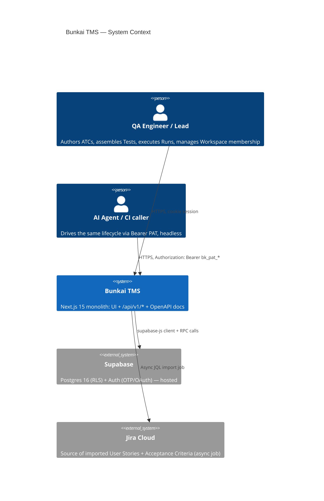
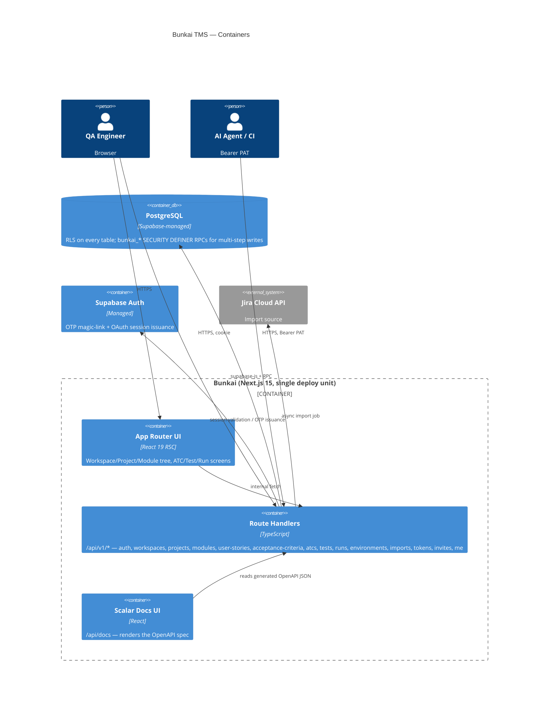
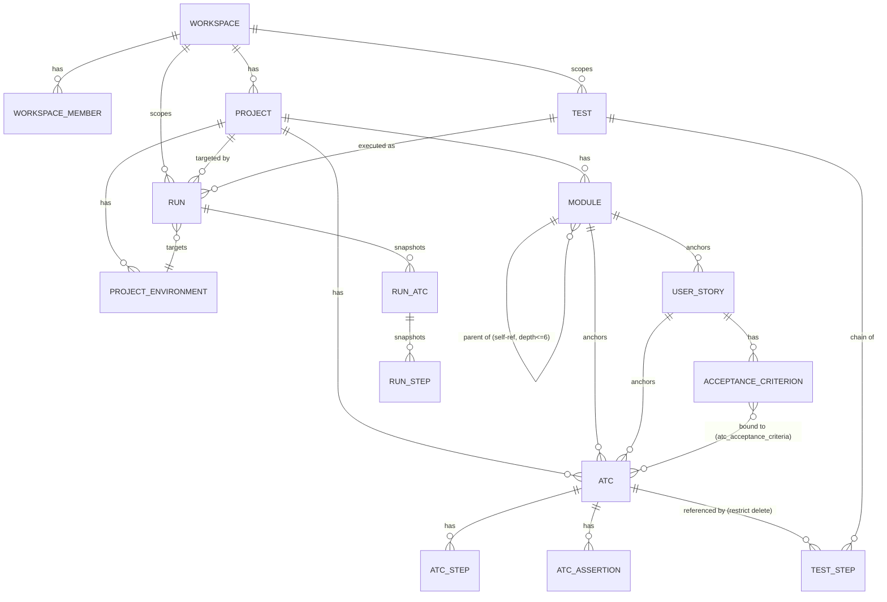
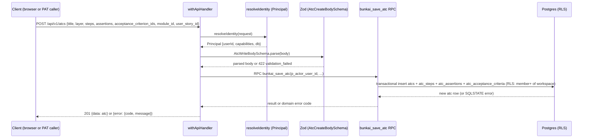
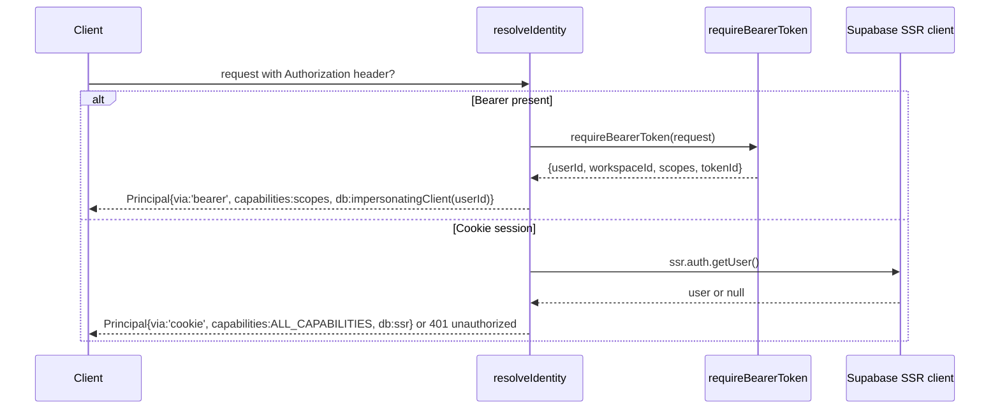

# Bunkai TMS — Architecture Specifications

> Generated: 2026-08-14 by `/project-discovery` Phase 2, SRS sub-step 1.
> Method: reverse-engineered from `../upex-bunkai-tms` — `package.json`, `supabase/migrations/0001–0037`, `lib/api/**`, `lib/supabase/**`.
> **Discrepancy notice**: the target's own internal `.context/SRS/architecture-specs.md` describes a two-edition system (Bunkai Cloud + self-hosted Community) with Cloudflare R2, Sentry, PostHog, Redis/BullMQ, and a `bugs` table — none of which were found in `package.json` dependencies or the 37 migrations read for this pass. That document is a forward-looking architecture plan; this document reflects only what is verifiably implemented today.

---

## System Overview

**Pattern**: Modular monolith — a single Next.js 15 App Router deployment serving both the UI (React Server Components) and the API (`app/api/v1/**` Route Handlers), backed by a single Supabase Postgres project. No separate backend service, no microservices.

| Layer | Technology | Evidence |
|---|---|---|
| Frontend | Next.js 15 (App Router), React 19, TypeScript ^5.9.3 (strict) | `package.json`; `tsconfig.json` `strict: true` |
| UI kit | Radix UI primitives, `shadcn`-style `components.json`, Tailwind CSS ^3.4, `lucide-react`, `cmdk` | `package.json`; `components.json` |
| Editor | Monaco Editor (`@monaco-editor/react`) | `package.json` |
| API docs | `@scalar/api-reference-react` at `app/api/docs` | `app/api/docs/page.tsx` |
| Backend | Next.js Route Handlers, no separate server process | `app/api/v1/**` |
| Validation | Zod ^4 + `@asteasolutions/zod-to-openapi` | `package.json`; `lib/*/validation.ts` (per-domain) |
| Data access | Direct `@supabase/supabase-js` client calls + Postgres RPC (`bunkai_*` SECURITY DEFINER functions) for multi-step writes | `lib/supabase/**`, `supabase/migrations/*.sql` |
| Database | PostgreSQL (Supabase-managed), RLS enabled on every table | `supabase/migrations/0001_tenancy.sql` onward |
| Auth | `@supabase/ssr` (cookie session) + custom Bearer PAT scheme | `lib/api/principal.ts`, `lib/api/pat.ts`, `lib/auth/oauth.ts` |
| Package manager | Bun (`bun.lock`) | target repo root |
| CI/CD | **None found** — no `.github/workflows/` in target repo | Phase 1 `project-config.md` |
| Hosting | Vercel (inferred from `*.vercel.app` domain convention and `POSTGRES_*` env-var shape) | `.env.example`; not independently confirmed via `vercel.json` |

## C4 Context Diagram



## C4 Container Diagram



## Component Structure

```
app/
  (app)/            -- authenticated UI: onboarding, projects, workspaces
  (auth)/login/     -- public sign-in UI
  api/v1/           -- Route Handlers, one folder per resource
  api/docs/          -- Scalar docs UI
  api/openapi/        -- OpenAPI JSON generation endpoint
  auth/callback, auth/oauth/[provider]  -- Supabase auth handshake
  invites/accept/    -- invite-consumption UI
  qa/                -- QA testability guide page
lib/
  api/               -- cross-cutting API concerns: principal resolution, error envelope,
                        idempotency, handler wrapper, request-id, logging, PAT, workspace-cookie
  auth/              -- OAuth state + flow helpers
  {atcs,modules,projects,runs,user-stories,acceptance-criteria,environments,workspaces}/
                     -- one folder per domain: validation.ts (Zod), errors.ts (domain error mapping)
  jira/              -- import-runner.ts (async JQL import)
  supabase/          -- client factories (server, admin/service-role)
  markdown/          -- sanitize + format (Markdown fields: byteLength budget enforcement)
supabase/migrations/ -- 0001-0037, hand-authored SQL, source of truth for schema + RPCs
```

| Component | Responsibility |
|---|---|
| `lib/api/principal.ts` | Resolves a unified `Principal` (userId, workspaceId, capabilities, RLS-scoped `db` client) from either a cookie session or a Bearer PAT — see Security Architecture |
| `lib/api/handler.ts` | `withApiHandler` wrapper — auth gate, error mapping, request-id injection |
| `lib/api/idempotency.ts` | `Idempotency-Key` header lifecycle backed by the `idempotency_keys` table |
| `lib/{domain}/validation.ts` | Zod schemas mirroring each table's CHECK constraints — first line of defense before the RPC re-validates |
| `lib/{domain}/errors.ts` | Maps domain-specific SQLSTATE codes to `ApiErrorCode` values |
| `supabase/migrations/*.sql` | Schema + RLS policies + `bunkai_*` RPC functions — the actual source of truth (no ORM) |

## Database Schema

### Entity-Relationship Diagram



*(Full entity attribute tables live in `.context/business/domain-glossary.md` §1 — not duplicated here per the SRS "table detail lives in one place" convention.)*

### Table Detail (summary — full column lists in `domain-glossary.md`)

| Table | Primary Key | Notable Constraints |
|---|---|---|
| `workspaces` | `id` (uuid) | `slug` unique; `plan` CHECK ∈ community/cloud/enterprise |
| `workspace_members` | `(workspace_id, user_id)` composite | `role` CHECK ∈ viewer/member/admin/owner; `status` CHECK ∈ active/invited/suspended |
| `modules` | `id` | self-ref `parent_module_id`; materialized `path` unique per project; depth ≤ 6 via CHECK on `path` slash count |
| `user_stories` | `id` | uniqueness added in `0016`; `ready_to_test` gate function `0018` |
| `acceptance_criteria` | `id` | `position` unique per story |
| `atcs` | `id` | `slug` unique per project; `layer` CHECK ∈ UI/API/Unit; `status` CHECK ∈ pass/fail/blocked/skipped/running/unrun |
| `atc_acceptance_criteria` | composite `(atc_id, acceptance_criterion_id)` | the anchoring-moat join |
| `tests` | `id` | workspace-scoped (not project-scoped); `title` 1–200 chars trimmed |
| `test_steps` | `id` (surrogate) | `(test_id, position)` unique; `atc_id` may legally repeat within one chain |
| `runs` | `id` | `status` CHECK ∈ running/passed/failed/aborted; `executor_mode` CHECK ∈ human/agent/ci; optimistic-lock `version` |
| `run_atcs` | `id` | `(run_id, position)` unique; `atc_id` `on delete set null` (provenance only) |
| `run_steps` | `id` | `atc_step_id` `on delete set null` (provenance only) |
| `project_environments` | `id` | `name` 1–60 chars, case-insensitive unique per project |
| `access_tokens` / `access_token_secrets` | `id` (split table) | secret hash isolated in sibling table, unreadable by QA/analytics DB roles |
| `idempotency_keys` | `key` | `status` CHECK ∈ pending/succeeded/failed; backs the `Idempotency-Key` header |
| `feature_flags` | n/a | `scope` CHECK ∈ global/workspace — infrastructure exists, no wired consumer found |

Indexes explicitly observed: `workspaces_owner_user_id_idx`, `workspace_members_user_id_idx` (both in `0001_tenancy.sql`, chosen because "what workspaces does this user belong to?" is the dominant RLS subquery path per the migration comment). Full index inventory not exhaustively read for every migration — Discovery Gap.

## Data Flow

### Request Sequence — ATC creation (representative write path)



### Auth Sequence — dual identity resolution



Source: `lib/api/principal.ts` lines 45–74.

## External Services

| Service | Purpose | Evidence |
|---|---|---|
| Supabase (Postgres + Auth) | Primary datastore, RLS enforcement, OTP/OAuth session issuance | `@supabase/ssr`, `@supabase/supabase-js` in `package.json` |
| Jira Cloud REST API | Async import of User Stories + Acceptance Criteria | `lib/jira/import-runner.ts`, `app/api/v1/imports/**` |
| Vercel | Inferred hosting (domain convention + `POSTGRES_*`/Vercel-Postgres-shaped env vars) | `.env.example`; not independently confirmed |
| Resend | `RESEND_API_KEY` present in `.env.example` | Purpose unconfirmed — `business-feature-map.md` notes invite emails are NOT sent in MVP, so this may be reserved/unused |
| Tavily / n8n | `TAVILY_API_KEY`, `N8N_API_URL`/`N8N_API_KEY` in `.env.example` | No corresponding call sites found in a surface pass — likely leftover from the shared "create-agentic-dev" boilerplate template, not Bunkai-specific |

**No** Sentry, DataDog, PostHog, Cloudflare R2, Redis, or BullMQ dependency was found in `package.json` — these appear in the target's own aspirational SRS but not in the current dependency tree.

## Security Architecture

### Authentication

Two coexisting, structurally unified identity paths (Source: `lib/api/principal.ts`, "ADR-0001" inline comment):

1. **Cookie session** — Supabase SSR (`@supabase/ssr`), magic-link OTP or headless email/password sign-in. Holds the full `ALL_CAPABILITIES` set implicitly (`atc:read`, `atc:write`, `run:execute`, `workspace:admin`) — the UI is the trusted client and gates writes itself.
2. **Bearer PAT** — `bk_pat_<prefix>.<secret>` format. `requireBearerToken` resolves it to `{userId, workspaceId, scopes, tokenId}`. Secret is hashed (SHA-256) and stored in a sibling `access_token_secrets` table, not the primary `access_tokens` row — unreadable by QA/analytics DB roles per `business-api-map.md` §2.

Both paths collapse into one `Principal` shape before reaching any route handler — "the parity gap... becomes structurally impossible because there is no second code path to forget" (`principal.ts` lines 16–18).

### Authorization

- **Row Level Security is the single source of truth.** Every table with a `workspace_id` (directly or transitively) carries a policy requiring an `active` `workspace_members` row for the caller. Handlers do not re-implement access checks in TypeScript (`principal.ts` line 25 comment).
- **Capability checks** (`requireCapability`) gate PAT callers only in practice — cookie sessions already hold the full capability set.
- **Workspace-scope binding** (`assertWorkspaceContext`) — a PAT scoped to workspace A is rejected outright (not silently narrowed) when it targets workspace B, or when it has no workspace binding at all and attempts a workspace-admin action. There is no global admin (`principal.ts` lines 85–104, "ADR-0005"/"ADR-0006" inline references).
- **RBAC role model**: `viewer` < `member` < `admin` < `owner`, ordinal-ranked in `lib/workspaces/invites.ts` (`ROLE_RANK`).

### Data Protection

- PAT secrets and workspace-invite tokens are stored as SHA-256 hashes in dedicated sibling tables (`access_token_secrets`, `workspace_invite_secrets`), isolated from the primary metadata rows.
- Cross-workspace resource references collapse into a single non-disclosing error (`atc_not_in_workspace`, SQLSTATE `45122`) — deliberately does not reveal whether the referenced id exists in another workspace (documented as invariant "INV-3" in `0024_tests.sql`).
- No data-at-rest encryption configuration was found in this repo (expected — Supabase manages this at the platform level; not independently verified).

### Session / Token Lifecycle

- Workspace invite tokens: 7-day expiry, one-time-visible in the API response (`business-feature-map.md` §2.3).
- Idempotency keys: `Idempotency-Key` header backed by `idempotency_keys` table, `KEY_PATTERN = /^[\w-]{8,128}$/`, replay/conflict semantics documented in `lib/api/idempotency.ts` lines 1–24.
- No explicit session-length/refresh-token config was found in this repo (Supabase Auth default behavior, not overridden in code found this pass).

## Performance Hooks

- Two indexes explicitly justified in migration comments for RLS-subquery performance (`workspaces_owner_user_id_idx`, `workspace_members_user_id_idx`).
- Postgres full-text search via `tsv` column + GIN-style search on `atcs` (`supabase/migrations/0027_atc_search.sql`).
- No caching layer (Redis, in-memory, `revalidate` tuning) or explicit rate-limiting middleware was found in `lib/api/**` — see Non-Functional Specs §1/§2 for the corresponding gaps.

## Discovery Gaps

- Exact hosting/deploy mechanism (Vercel git-integration vs. manual deploy) not independently confirmed — no `vercel.json` or `next.config.ts` environment block found.
- Full index inventory not exhaustively read across all 37 migrations — only the two RLS-performance indexes named in `0001_tenancy.sql` were directly cited.
- `access_tokens.scopes` full CHECK constraint (which scope strings are legal) referenced by `principal.ts` comment ("Keep in sync with the scopes CHECK in migration 0008_access_tokens.sql") but that migration file was not independently re-read this pass.
- `RESEND_API_KEY`, `TAVILY_API_KEY`, `N8N_API_URL`/`N8N_API_KEY` purpose in the Bunkai product specifically (vs. inherited from the shared boilerplate) — unconfirmed.
- Database connectivity via the DBHub MCP was not exercised this session (schema was read from migration source files directly) — live-schema drift from the migrations, if any, is unverified.

## QA Relevance

### Components to Test

- `lib/api/principal.ts` — dual-auth parity (every protected route behaves identically under cookie vs. PAT) is the single highest-value security test target in this codebase.
- Every `bunkai_*` RPC's SQLSTATE error surface (`45120`–`45207` range) — assert on `error.code`, not just HTTP status.
- RLS cross-tenant isolation — for every table with a `workspace_id`, a workspace-B member must never read or write a workspace-A row.
- Idempotency-Key replay/conflict paths on every POST endpoint that supports it.

### Environment Requirements

- A reachable Supabase project (staging, per this QA repo's environment policy) with the full 37-migration schema applied.
- At least one minted PAT with a known, narrow scope set for capability-boundary testing.
- No CI/CD pipeline exists in the target repo — regression suites run locally/manually against `staging-upexbunkai.vercel.app` until a pipeline is introduced.
