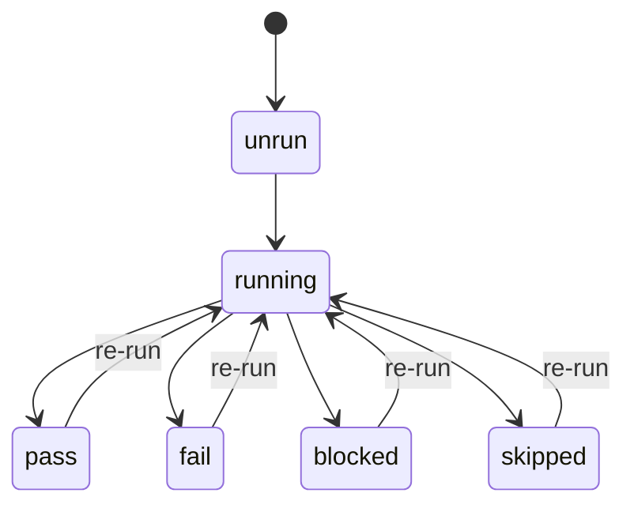
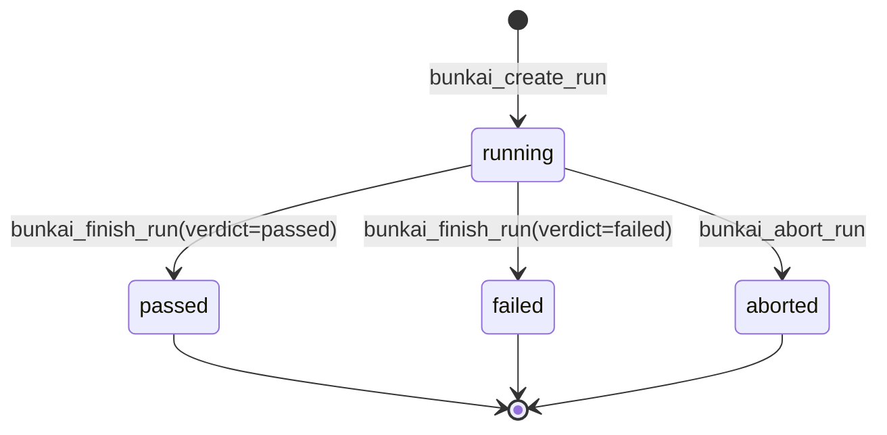
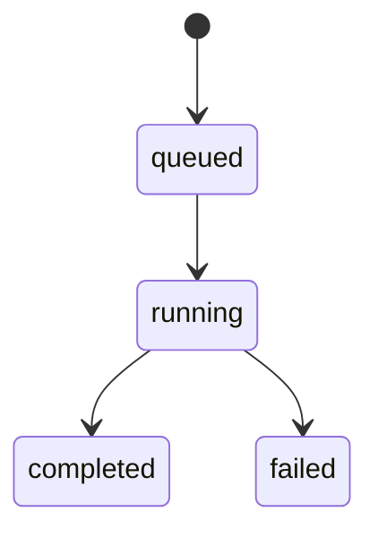

# Bunkai TMS — Functional Specifications

> Generated: 2026-08-14 by `/project-discovery` Phase 2, SRS sub-step 2.
> Method: FR entries derived from `lib/{domain}/validation.ts` + `supabase/migrations/*.sql` RPC bodies + `lib/api/error-envelope.ts`. Cross-referenced against `.context/business/business-feature-map.md` and `.context/PBI/epics/EPIC-BK-44-coverage-traceability/` (BK-45/BK-50 business rules already surfaced by prior sprint-testing sessions in this QA repo).
> API contract location: technical surface = `bun run api:sync` output (`api/openapi-types.ts`), not yet regenerated this session; business angle = `.context/business/business-api-map.md` (pre-existing, generated 2026-06-08, predates Runs shipping). This SRS records FR/BR content only, per doctrine — it does not restate endpoint contracts.

---

## Specification Index

| ID | Feature | Category | Priority |
|---|---|---|---|
| FR-001 | Workspace creation | Tenancy | P0 |
| FR-002 | Workspace membership invite lifecycle | Tenancy | P0 |
| FR-003 | Module tree management | Authoring | P0 |
| FR-004 | User Story + Acceptance Criteria authoring | Authoring | P0 |
| FR-005 | ATC creation (anchoring moat) | Authoring | P0 |
| FR-006 | ATC duplication | Authoring | P2 |
| FR-007 | Test assembly (ATC chain) | Assembly | P0 |
| FR-008 | Run creation | Execution | P0 |
| FR-009 | Run abort | Execution | P1 |
| FR-010 | Run finish (verdict) | Execution | P0 |
| FR-011 | Personal Access Token issuance | Auth/API | P1 |
| FR-012 | Idempotency-Key request replay | Cross-cutting | P1 |
| FR-013 | Jira async import | Integration | P2 |

---

## FR-001: Workspace Creation

**Overview**

| Field | Value |
|---|---|
| Feature | Workspace bootstrap |
| Related PRD section | `user-journeys.md` Journey 1 |
| Service/method | RPC `bunkai_bootstrap_workspace` |
| Evidence | `app/api/v1/workspaces` (POST); `supabase/migrations/0001_tenancy.sql` |

**Functional Requirement**: The system shall create a new Workspace and automatically enroll the creating user as its `owner` in a single transactional call.

**Input Specification**

| Field | Type | Required |
|---|---|---|
| `name` | string | Yes |
| `slug` | string | Yes (or auto-derived) |

**Validation Rules**: slug — lowercase letters/digits/hyphens, 3–40 chars, no leading/trailing hyphen; reserved slugs blocked (`admin`, `api`, `app`, `auth`, `docs`, `invites`, `login`, `logout`, `onboarding`, `projects`, `public`, `qa`, `settings`, `static`, `workspaces`, `_next`) — Source: `business-feature-map.md` §2.2.

**Processing Logic**:
1. Caller authenticated (cookie or PAT).
2. `bunkai_bootstrap_workspace` RPC inserts `workspaces` row with `owner_user_id = auth.uid()`.
3. Same transaction inserts `workspace_members(workspace_id, user_id, role='owner', status='active')`.

**Output Specification**: 201 with the created workspace; slug collision → `409 conflict` (inferred from the unique constraint on `workspaces.slug`, not independently traced to a specific error code this pass).

**Business Rules**: BR-001 (see below).

**Edge Cases**

| Case | Expected |
|---|---|
| Reserved slug submitted | Rejected |
| Slug already taken | Conflict rejection |
| `plan` field | Defaults to `community`; no billing enforcement found |

---

## FR-002: Workspace Membership Invite Lifecycle

**Overview**

| Field | Value |
|---|---|
| Feature | Invite issue / accept / resend / revoke |
| Related PRD section | `user-journeys.md` Journey 3 |
| Service/method | `lib/workspaces/invites.ts` (`inviteAcceptAction`), `app/api/v1/workspaces/{id}/invites/**`, `app/api/v1/invites/accept` |
| Evidence | `lib/workspaces/invites.ts`, `invites.test.ts` |

**Functional Requirement**: The system shall let an `admin`/`owner` issue a role-scoped, time-boxed invite, and let the invitee activate membership by presenting the invite token, subject to a role-conflict guard.

**Input Specification**

| Field | Type | Required |
|---|---|---|
| `email` | string | Yes (issue) |
| `role` | enum (`viewer`\|`member`\|`admin`\|`owner`) | Yes (issue) |
| `token` | string | Yes (accept) |

**Validation Rules**: issuance gated to `admin`/`owner` via RLS on `workspace_members`; accept requires email match to the authenticated user (Source: `business-api-map.md` Journey 2).

**Processing Logic** (accept path, `inviteAcceptAction`):
1. Look up the existing `workspace_members` row (if any) for `(workspace_id, user_id)`.
2. Compute `existingRank = ROLE_RANK[existing.role] ?? 0` (unknown/absent role ranks lowest).
3. If no existing row, or existing `status != 'active'` → `upsert` (activate with the invite's role).
4. If existing row is `active` and its rank ≥ the invite's rank → `reject_already_member` (a same-or-lower-role invite over an active membership is a no-op conflict, not silently applied).
5. If existing row is `active` and its rank < the invite's rank → `upsert` (promotion allowed).

**Output Specification**: Success → `workspace_members` upserted to `status='active'`. Rejection → `reject_already_member`, no state change.

**Business Rules**: BR-002.

**Edge Cases**

| Case | Expected | Evidence |
|---|---|---|
| Invitee already `member`, invited again as `member` | `reject_already_member` | `invites.test.ts` line 17-18 |
| Invitee already `owner`, invited as `viewer` | `reject_already_member` (rank-protected) | `invites.test.ts` line 22 |
| Invitee `member`, invited as `admin` (promotion) | `upsert` | `invites.test.ts` line 26 |
| Existing row has an unrecognized/legacy role string | Ranks lowest, never blocks a promotion | `invites.test.ts` line 30 |
| Invite token > 7 days old | Rejected | `business-feature-map.md` §2.3 |

---

## FR-003: Module Tree Management

**Overview**

| Field | Value |
|---|---|
| Feature | Module create/rename/move/soft-delete |
| Related PRD section | `user-journeys.md` Journey 1 |
| Service/method | RPCs `bunkai_move_module`, `bunkai_archive_module_subtree`; `app/api/v1/modules/{id}` |
| Evidence | `supabase/migrations/0002_projects_modules.sql`, `0015_module_move.sql`, `0014_module_soft_delete.sql` |

**Functional Requirement**: The system shall organize a Project's test suite as a self-referential tree of Modules, capped at 6 levels of depth, with cascading soft-delete.

**Input Specification**

| Field | Type | Required |
|---|---|---|
| `name` | string | Yes |
| `parent_module_id` | uuid, nullable | No (root if omitted) |
| `description` | markdown string | No |

**Validation Rules**: `path` (materialized, slash-separated) unique per project; depth ≤ 6 enforced by CHECK splitting `path` on `/`.

**Processing Logic**:
1. Create: insert with `parent_module_id`; `path` computed from parent's path + slug of `name`.
2. Move (`bunkai_move_module`): reparents a subtree; guards against cycles, depth violation, and cross-project moves.
3. Soft-delete (`bunkai_archive_module_subtree`): archives the module subtree AND cascades to linked User Stories, ACs, ATCs.

**Output Specification**: 200/201 with the module row (or subtree summary for soft-delete).

**Business Rules**: BR-003.

**Edge Cases**

| Case | Expected |
|---|---|
| Creating a module at depth 7 | Rejected by CHECK constraint |
| Moving a module to create a cycle (parent → own descendant) | Rejected by `bunkai_move_module` guard |
| Moving a module across projects | Rejected |
| Soft-deleting a module with active ATCs beneath it | ATCs archived too (cascade), not orphaned |

---

## FR-004: User Story + Acceptance Criteria Authoring

**Overview**

| Field | Value |
|---|---|
| Feature | User Story + AC CRUD, ordering, readiness gate |
| Service/method | `app/api/v1/user-stories/**`, `app/api/v1/acceptance-criteria/**`; RPC-backed `ready_to_test` gate |
| Evidence | `supabase/migrations/0003_authoring.sql`, `0016_user_story_uniqueness.sql`, `0017_acceptance_criteria_ordering.sql`, `0018_ready_to_test_gate_fn.sql` |

**Functional Requirement**: The system shall let a User Story be authored (natively or imported from Jira) and hold one or more ordered Acceptance Criteria, with a readiness gate distinguishing `draft` from `ready_to_test`.

**Input Specification**

| Field | Type | Required |
|---|---|---|
| `title` | string | Yes |
| `description` | markdown string | No |
| `external_id` / `external_url` | string | No (set on Jira import) |
| AC `title`/`description`/`position` | string / string / integer | Yes for title, position auto-managed |

**Validation Rules**: uniqueness constraint added in `0016` (exact rule not re-read this pass — Discovery Gap); AC `position` unique per story, reorderable per `0017`.

**Processing Logic**: readiness gate function (`0018`) computes `ready_to_test` — exact trigger conditions not independently re-read this pass (Discovery Gap; state machine below is the schema-confirmed value set only).

**Output Specification**: Standard CRUD responses; state transitions surfaced via the `status` field.

**Business Rules**: n/a beyond uniqueness/ordering.

**Edge Cases**

| Case | Expected |
|---|---|
| Duplicate story within the same module (per `0016` uniqueness rule) | Rejected — exact scope of "duplicate" not independently confirmed |
| AC position collision on reorder | Handled by the ordering migration's positional-swap logic (not independently re-read) |

---

## FR-005: ATC Creation (Anchoring Moat)

**Overview**

| Field | Value |
|---|---|
| Feature | ATC create/update via `bunkai_save_atc` |
| Related PRD section | `executive-summary.md` §2 (core differentiator) |
| Service/method | `lib/atcs/validation.ts`, RPC `bunkai_save_atc` |
| Evidence | `supabase/migrations/0004_atcs.sql`, `0007_save_atc.sql`, `0021_atc_create_update.sql` |

**Functional Requirement**: The system shall reject any ATC create or full-replace update that is not bound to at least one Acceptance Criterion, at least one Step, a valid `layer`, and a title within bounds.

**Input Specification**

| Field | Type | Required | Bounds |
|---|---|---|---|
| `title` | string | Yes | 3–200 chars (`ATC_TITLE_MIN`/`MAX`) |
| `layer` | enum | Yes | `UI` \| `API` \| `Unit` |
| `tags` | string[] | No | max 10 (`MAX_ATC_TAGS`) |
| `steps` | array | Yes | min 1 item; each `content` 1..2048 UTF-8 bytes |
| `assertions` | array | No | each `content` 1..2048 UTF-8 bytes |
| `acceptance_criterion_ids` | uuid[] | Yes | **min 1** — the anchoring moat |
| `module_id`, `user_story_id` | uuid | Yes (create only) | immutable after create |

**Validation Rules** (code evidence, `lib/atcs/validation.ts`):

```ts
export const AtcWriteBodySchema = z.object({
  title: z.string().min(ATC_TITLE_MIN).max(ATC_TITLE_MAX),
  layer: z.enum(ATC_LAYERS),
  tags: z.array(z.string()).max(MAX_ATC_TAGS).optional().default([]),
  steps: z.array(AtcStepInputSchema).min(1),
  assertions: z.array(AtcAssertionInputSchema).optional().default([]),
  acceptance_criterion_ids: z.array(z.string().uuid()).min(1),
});
```

Step positions must be strictly increasing integers starting at 1 (gaps allowed, e.g. `[1,2,5]`) — enforced by `stepPositionsError()`, not by the Zod schema itself.

**Processing Logic**:
1. Client/server Zod validation (`AtcWriteBodySchema`) — fails fast as 422 before any DB round-trip.
2. `stepPositionsError()` checked separately — offending positions returned in the error body.
3. `bunkai_save_atc` RPC persists `atcs` + `atc_steps` + `atc_assertions` + `atc_acceptance_criteria` transactionally; PATCH is full-replace (omitted children are cleared, not merged).
4. RPC re-validates the ≥1-AC anchoring rule as the structural backstop (FK-supported, per `0004_atcs.sql` comment).

**Output Specification**: 201 (create) / 200 (update) with the ATC row; validation failures → `422 validation_failed`; step-position violations → `steps_position_invalid`.

**Business Rules**: BR-004 (anchoring moat).

**Edge Cases**

| Case | Expected | Evidence |
|---|---|---|
| `acceptance_criterion_ids: []` | 422, rejected before persistence | `validation.ts` line 41 |
| Step content exceeding 2048 UTF-8 bytes | Rejected — `byteLength`, not `.max()`, so multibyte content is measured correctly | `validation.ts` lines 13, 19 |
| Step positions `[1, 3]` (skips 2) | **Allowed** — gaps are legal | `stepPositionsError()` comment |
| Step positions `[2, 1]` (not starting at 1 / not increasing) | Rejected | `stepPositionsError()` |
| PATCH omitting an existing assertion | Assertion is deleted (full-replace semantics) | `validation.ts` line 33 comment |

---

## FR-006: ATC Duplication

**Overview**

| Field | Value |
|---|---|
| Feature | Duplicate an existing ATC |
| Service/method | `AtcDuplicateBodySchema`, `defaultCopyTitle()` |
| Evidence | `lib/atcs/validation.ts` lines 56–69; `supabase/migrations/0028_atc_duplicate.sql` |

**Functional Requirement**: The system shall create a copy of an ATC, defaulting the title to `<source title> (copy)` when none is supplied.

**Input Specification**: optional `title` (3–200 chars); empty body valid.

**Business Rules**: n/a.

**Edge Cases**

| Case | Expected |
|---|---|
| Duplicating a title that is itself already `"X (copy)"` | Result is `"X (copy) (copy)"` — **explicitly documented as PO-PENDING, no de-dup logic** (`validation.ts` line 66 comment) |

---

## FR-007: Test Assembly (ATC Chain)

**Overview**

| Field | Value |
|---|---|
| Feature | Test creation as an ordered ATC chain |
| Service/method | RPC `bunkai_create_test` |
| Evidence | `supabase/migrations/0024_tests.sql` (BK-27) |

**Functional Requirement**: The system shall assemble a Test as a workspace-scoped, ordered chain of ATC references (not copies), rejecting empty chains and chains containing ATCs outside the caller's workspace.

**Input Specification**

| Field | Type | Required |
|---|---|---|
| `title` | string | Yes, 1–200 chars trimmed |
| `atc_ids` (ordered) | uuid[] | Yes, min 1 |

**Validation Rules / Processing Logic**:
1. `coalesce(array_length(p_atc_ids, 1), 0) < 1` → raise `chain_empty` (SQLSTATE `45120`) before any row is inserted (`0024_tests.sql` lines 203–206).
2. Resolved-count vs. distinct-count comparison: every distinct ATC id must resolve to a **non-archived** ATC belonging to a project inside the target workspace. A mismatch (foreign-workspace id OR nonexistent id) raises one uniform `atc_not_in_workspace` (SQLSTATE `45122`) with **no id echoed back** — deliberate non-disclosure (invariant "INV-3") (`0024_tests.sql` lines 208–225).
3. `test_steps` uses a surrogate PK because the same `atc_id` may legally repeat at multiple chain positions.

**Output Specification**: 201 with the Test + its `test_steps`; `422 chain_empty` / `422 atc_not_in_workspace` on the respective failures.

**Business Rules**: BR-005, BR-006.

**Edge Cases**

| Case | Expected | Evidence |
|---|---|---|
| Empty `atc_ids` array | `chain_empty` 422 | `0024_tests.sql` 203–206 |
| One `atc_id` from a different workspace | `atc_not_in_workspace` 422, id not disclosed | `0024_tests.sql` 208–225 |
| Same `atc_id` twice in the chain (positions 1 and 4) | Allowed | `test_steps` surrogate PK design |
| ATC referenced is soft-archived | Excluded from resolved-count → triggers `atc_not_in_workspace` | inferred from "non-archived" resolution rule |

---

## FR-008: Run Creation

**Overview**

| Field | Value |
|---|---|
| Feature | Start a Run against a Test + environment |
| Service/method | `lib/runs/validation.ts` (`RunCreateBodySchema`), RPC `bunkai_create_run` |
| Evidence | `supabase/migrations/0031_runs.sql` (BK-34) |

**Functional Requirement**: The system shall snapshot a Test's ATC chain and every step's content at Run-start time, so subsequent edits to the source ATC never retroactively alter a Run's recorded content.

**Input Specification**

| Field | Type | Required |
|---|---|---|
| `test_id` | uuid | Yes |
| `environment_id` | uuid | Yes |
| `executor_mode` | enum (`human`\|`agent`\|`ci`) | No — cookie sessions default to `human`; a PAT may declare `agent`/`ci` |
| `start_token` | string, 1–200 chars | No — server mints one when absent |

**Validation Rules** (code evidence):
```ts
export const RunCreateBodySchema = z.object({
  test_id: z.string().uuid(),
  environment_id: z.string().uuid(),
  executor_mode: z.enum(RUN_EXECUTOR_MODES).optional(),
  start_token: z.string().trim().min(1).max(RUN_START_TOKEN_MAX).optional(),
});
```

**Processing Logic**:
1. Zod validation mirrors the RPC rulebook (fail fast, 422, before any DB round-trip).
2. `bunkai_create_run` RPC is the enforcement point of record — re-validates environment containment (the environment must belong to the Test's Project), the executable-steps gate (the Test must have ≥1 step), and a 24h idempotency window on `(test_id, start_token)` under lock.
3. On success: `runs` row inserted (`status='running'`), plus a frozen `run_atcs` row per chain position and a frozen `run_steps` row per executable step — independent content copies, not live references.

**Output Specification**: 201 with `run_id` + `status: 'running'`; a retried `(test_id, start_token)` pair within 24h returns the **same** `run_id` (idempotent, not a duplicate).

**Business Rules**: BR-007 (snapshot immutability).

**Edge Cases**

| Case | Expected | Evidence |
|---|---|---|
| Test has 0 executable steps | `no_executable_steps` | `error-envelope.ts` |
| `environment_id` belongs to a different Project than the Test | `environment_invalid` | `error-envelope.ts` |
| Retry with same `(test_id, start_token)` within 24h | Returns original `run_id`, no duplicate Run | `runs/validation.ts` comment |
| Source ATC edited after the Run starts | Run's `run_steps.content` stays frozen (does not reflect the edit) | `0031_runs.sql` lines 117–179; reaffirmed by `0035_atc_update_propagation.sql` |

---

## FR-009: Run Abort

**Overview**

| Field | Value |
|---|---|
| Feature | Abort an in-progress Run with a reason |
| Service/method | `RunAbortBodySchema`, RPC `bunkai_abort_run` |
| Evidence | `supabase/migrations/0036_run_abort.sql` (BK-36) |

**Functional Requirement**: The system shall allow only a Run in `running` status to be aborted, requiring a bounded, non-empty reason, surfacing AC-exact error copy on validation failure.

**Input Specification**: `reason` — string, trimmed, 3–500 chars.

**Validation Rules**:
```ts
export const RunAbortBodySchema = z.object({
  reason: z.string().trim().min(RUN_ABORT_REASON_MIN).max(RUN_ABORT_REASON_MAX),
});
```
Frozen, AC-exact messages surfaced **verbatim** (never the generic `ZodError` envelope): `"Please give a reason of at least 3 characters"` / `"The reason must be at most 500 characters"`.

**Processing Logic**: `bunkai_abort_run` row-locks the Run, re-checks `status='running'`, sets `status='aborted'`, records the reason.

**Output Specification**: 200 with `status='aborted'`; a second abort/finish attempt on an already-terminal Run is rejected (see FR-010's concurrency rule — same first-terminal-action-wins pattern).

**Business Rules**: BR-008.

**Edge Cases**

| Case | Expected |
|---|---|
| `reason` = 2 chars | Rejected, AC-exact "at least 3 characters" message |
| `reason` = 501 chars | Rejected, AC-exact "at most 500 characters" message |
| Abort on an already-`aborted`/`passed`/`failed` Run | Rejected (terminal state) |

---

## FR-010: Run Finish (Verdict)

**Overview**

| Field | Value |
|---|---|
| Feature | Finish a Run with a final verdict |
| Service/method | RPC `bunkai_finish_run` |
| Evidence | `supabase/migrations/0037_run_finish.sql` (BK-39) |

**Functional Requirement**: The system shall allow only a Run in `running` status to be finished, with a verdict of `passed` or `failed`; a concurrent second finish/abort attempt on the same Run must lose deterministically.

**Input Specification**: `verdict` — enum, `passed` \| `failed` (`aborted` is not a valid finish verdict — abort is its own action, FR-009).

**Validation Rules**: AC-exact frozen message on missing/invalid verdict: `"Select a final verdict of passed or failed to finish the run."` — surfaced verbatim, never the generic ZodError envelope.

**Processing Logic**: `bunkai_finish_run` takes a `FOR UPDATE` row lock on the Run, re-checks `status='running'` under the lock; if already terminal, raises `run_not_finishable` (SQLSTATE `45206`) rather than silently succeeding.

**Output Specification**: 200 with the finalized `status`; second concurrent attempt → modeled as HTTP 409 (`run_not_finishable`).

**Business Rules**: BR-009 (first-terminal-action wins).

**Edge Cases**

| Case | Expected | Evidence |
|---|---|---|
| Finish a Run already `passed` | `run_not_finishable`, SQLSTATE `45206` | `0037_run_finish.sql` lines 39–43 |
| Two concurrent finish requests for the same Run | Row lock ensures only one succeeds; the loser gets `run_not_finishable` | same |
| `verdict` omitted or invalid | AC-exact required-verdict message, not generic ZodError | `runs/validation.ts` |

---

## FR-011: Personal Access Token Issuance

**Overview**

| Field | Value |
|---|---|
| Feature | Mint/list/revoke a PAT |
| Service/method | `lib/api/pat.ts`, `app/api/v1/tokens/**` |
| Evidence | `lib/api/principal.ts` (`ALL_CAPABILITIES`), `access_tokens`/`access_token_secrets` tables |

**Functional Requirement**: The system shall mint a `bk_pat_<prefix>.<secret>` token scoped to a subset of `{atc:read, atc:write, run:execute, workspace:admin}`, storing only a SHA-256 hash of the secret.

**Input Specification**: `scopes` (subset of `ALL_CAPABILITIES`), optional `workspace_id` binding.

**Business Rules**: BR-010 (workspace-scope binding).

**Edge Cases**

| Case | Expected |
|---|---|
| Token minted with no `workspace_id` | Can never perform workspace-admin operations (no global admin exists) |
| Token used against a workspace it is not scoped to | `403 forbidden`, "This token is scoped to a different workspace." |
| Headless signup/signin | Mints a PAT in the same round-trip as authentication |

---

## FR-012: Idempotency-Key Request Replay

**Overview**

| Field | Value |
|---|---|
| Feature | `Idempotency-Key` header semantics on POST endpoints |
| Service/method | `lib/api/idempotency.ts` |
| Evidence | `supabase/migrations/0009_cross_cutting.sql` (`idempotency_keys` table) |

**Functional Requirement**: The system shall guarantee that a retried POST with the same `Idempotency-Key` and identical payload returns the original stored response rather than repeating the business write.

**Processing Logic**:
1. Compute SHA-256 of the payload; look up `(user_id, endpoint, key)`.
2. Row found + same hash + `succeeded` → replay: return stored response snapshot.
3. Row found + different hash → `409 conflict` (same key reused for a different payload — client bug).
4. Row found + same hash + `pending` → `409 conflict` (request already in flight).
5. Row found + same hash + `failed` → atomic compare-and-set reclaims the row (`failed → pending`) so exactly one concurrent retry proceeds.
6. No row → insert `pending`; a concurrent duplicate insert loses on the unique constraint → `409`.

**Business Rules**: BR-011.

**Edge Cases**

| Case | Expected |
|---|---|
| Same key, same payload, prior success | Replayed response, no duplicate write |
| Same key, different payload | `409 conflict` |
| Two concurrent requests with the same fresh key | Exactly one proceeds; the other gets `409` |
| Key format outside `/^[\w-]{8,128}$/` | Rejected (`idempotency_key_invalid`) |

---

## FR-013: Jira Async Import

**Overview**

| Field | Value |
|---|---|
| Feature | JQL-based import of User Stories + Acceptance Criteria from Jira |
| Service/method | `lib/jira/import-runner.ts`, `app/api/v1/imports/**` |
| Evidence | `supabase/migrations/0019_import_jobs.sql`; `business-feature-map.md` §1 "Jira Import" |

**Functional Requirement**: The system shall run an async, pollable import job against a JQL query, idempotently upserting Stories + ACs (re-running the same query must not duplicate rows).

**Processing Logic**: `import_jobs.status` state machine (see State Machines below); polling client checks job status until `completed`/`failed`.

**Business Rules**: n/a beyond idempotent upsert (exact key not independently re-read this pass — Discovery Gap).

**Edge Cases**

| Case | Expected |
|---|---|
| Re-running the same JQL import | Idempotent upsert, not duplicate Stories |
| Import job fails mid-run | `status='failed'`, partial state not independently characterized this pass |

---

## State Machines

### ATC status



| From | To | Trigger | Guard | Side Effects |
|---|---|---|---|---|
| `unrun` | `running` | Not independently confirmed — inferred | — | — |
| `running` | `pass`/`fail`/`blocked`/`skipped` | Not independently confirmed — inferred | — | — |

Source: `atcs.status` CHECK constraint proves the valid state *set*; the transition graph is inferred, not verified (per `domain-glossary.md` §6). **Treat as a Discovery Gap** before writing a State-Transition test matrix.

### Run status



| From | To | Trigger | Guard | Side Effects |
|---|---|---|---|---|
| (none) | `running` | `POST /api/v1/runs` → `bunkai_create_run` | Test has ≥1 executable step; environment belongs to Test's project; idempotency window | Snapshots `run_atcs`/`run_steps` |
| `running` | `passed`/`failed` | `bunkai_finish_run` | Row lock; `status='running'` re-checked | Finalizes verdict, `finished_at` set |
| `running` | `aborted` | `bunkai_abort_run` | Row lock; `status='running'` re-checked; reason 3–500 chars | Records abort reason |

This state machine is **verified** (all three transitions independently confirmed against RPC source in `0031`/`0036`/`0037`), unlike ATC status above. Terminal states are one-way — `bunkai_finish_run` explicitly rejects re-finishing a closed Run.

### Import job status



Source: `import_jobs.status` CHECK ∈ `queued`/`running`/`completed`/`failed` (`0019_import_jobs.sql`). Transition triggers not independently re-read this pass (Discovery Gap).

---

## Business Rules Summary

| ID | Rule | Entities | Evidence |
|---|---|---|---|
| BR-001 | A new Workspace's creator is auto-enrolled as `owner` in the same transaction | `workspaces`, `workspace_members` | `0001_tenancy.sql`, RPC `bunkai_bootstrap_workspace` |
| BR-002 | An invite accept over an existing equal-or-higher-role active membership is rejected as a conflict, not silently applied | `workspace_members` | `lib/workspaces/invites.ts` |
| BR-003 | Module tree depth is capped at 6 levels | `modules` | `0002_projects_modules.sql` CHECK on `path` |
| BR-004 | An ATC must be bound to ≥1 Acceptance Criterion ("the anchoring moat") | `atcs`, `acceptance_criteria`, `atc_acceptance_criteria` | `0004_atcs.sql` lines 1–6; `validation.ts` line 41 |
| BR-005 | A Test's ATC chain must contain ≥1 ATC | `tests`, `test_steps` | `0024_tests.sql` lines 203–206, `chain_empty` |
| BR-006 | Every ATC id in a Test chain must resolve to a non-archived ATC inside the caller's workspace; violations collapse into one non-disclosing error | `tests`, `atcs`, `projects`, `workspaces` | `0024_tests.sql` lines 208–225, `atc_not_in_workspace` |
| BR-007 | A Run's chain/step snapshot is frozen at start time; later edits to the source ATC never retroactively change it | `runs`, `run_atcs`, `run_steps`, `atcs`, `atc_steps` | `0031_runs.sql` lines 117–179 |
| BR-008 | A Run can only be aborted while `running`; reason is required, 3–500 chars | `runs` | `0036_run_abort.sql` |
| BR-009 | A Run can only be finished/aborted once — first terminal action wins under a row lock | `runs` | `0037_run_finish.sql` lines 39–43 |
| BR-010 | A PAT with no workspace binding can never perform a workspace-admin operation; a PAT scoped to workspace A cannot act on workspace B | `access_tokens` | `principal.ts` lines 91–104 |
| BR-011 | A retried POST with the same Idempotency-Key and identical payload replays the stored response instead of repeating the write | (cross-cutting) | `lib/api/idempotency.ts` |

## Validation Rules Catalog

| Entity | Field | Rules | Error Message (if AC-exact) |
|---|---|---|---|
| `atcs` | `title` | 3–200 chars | generic Zod |
| `atcs` | `layer` | ∈ UI/API/Unit | generic Zod |
| `atcs` | `tags` | max 10 items | generic Zod |
| `atcs` steps/assertions `content` | byte length | ≤ 2048 UTF-8 bytes | "Content must be at most 2048 bytes." |
| `atcs` | `acceptance_criterion_ids` | min 1 item | generic Zod (422) |
| `atc_steps` | `position` | strictly increasing integers from 1, gaps allowed | `steps_position_invalid` + offending positions |
| `tests` | `title` | 1–200 chars, trimmed | generic |
| `tests` | `atc_ids` | min 1, all resolve inside caller's workspace | `chain_empty` / `atc_not_in_workspace` |
| `runs` | `start_token` | 1–200 chars | generic |
| `runs` abort | `reason` | 3–500 chars, trimmed | AC-exact frozen copy (too short / too long) |
| `runs` finish | `verdict` | ∈ passed/failed | AC-exact frozen copy (verdict required) |
| Idempotency-Key header | key | `/^[\w-]{8,128}$/` | `idempotency_key_invalid` |

## Discovery Gaps

- ATC status transition triggers (what UI/API action fires `unrun → running`, etc.) — only the valid state *set* is schema-confirmed.
- `user_stories` uniqueness rule (`0016`) exact scope — not independently re-read.
- `ready_to_test` gate function (`0018`) exact trigger conditions — not independently re-read.
- `access_tokens.scopes` CHECK constraint (`0008_access_tokens.sql`) — referenced by comment, not independently re-read.
- Import job idempotent-upsert key (what makes a re-run "the same" Story/AC) — not independently re-read.
- Application-layer error message text for the ATC anchoring-moat rejection was not located in a migration-visible RPC (per `domain-glossary.md` §8) — likely lives in the route handler, not the RPC.

## QA Relevance

Every FR above maps to a Boundary Value Analysis target where a numeric/length bound exists (ATC title 3/200, content 2048 bytes, abort reason 3/500, idempotency key 8/128 chars, module depth 6). Every Business Rule (BR-001 through BR-011) is a mandatory test-beyond-AC candidate per this QA repo's test-design doctrine — none of them are optional "nice to cover", they are the product's structural differentiators. State-Transition testing should target the **Run** state machine first (verified transitions) before the ATC state machine (unverified transitions, flagged above).
