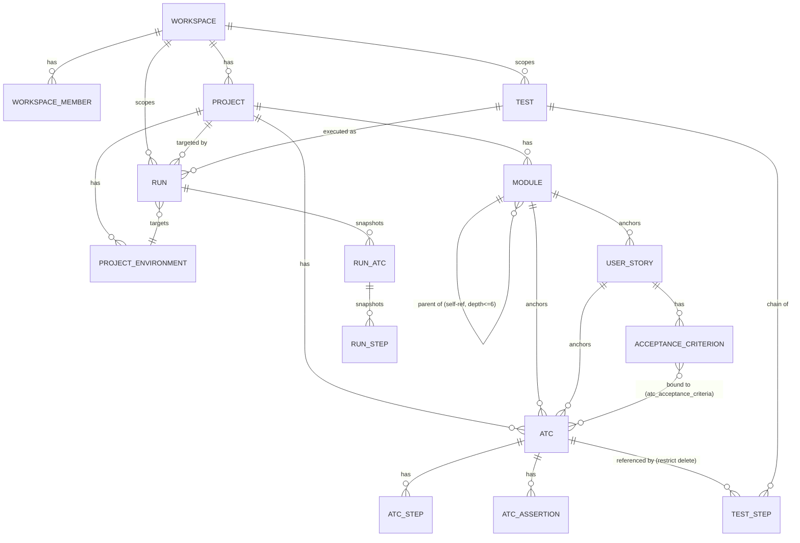
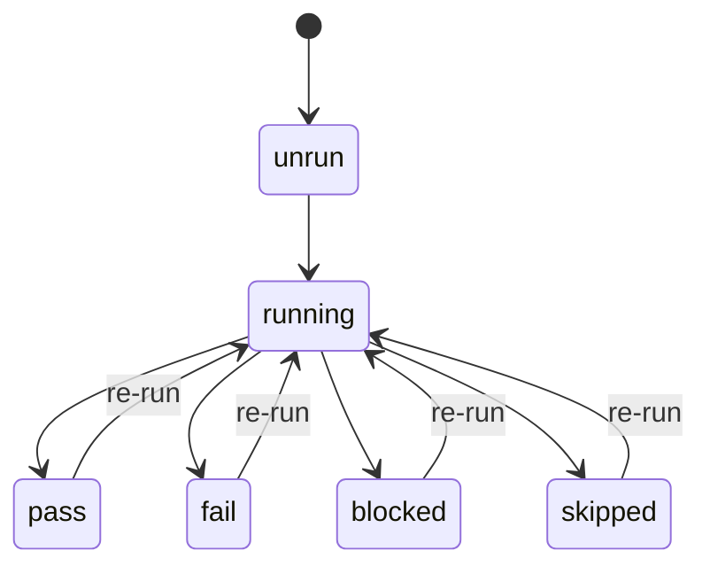
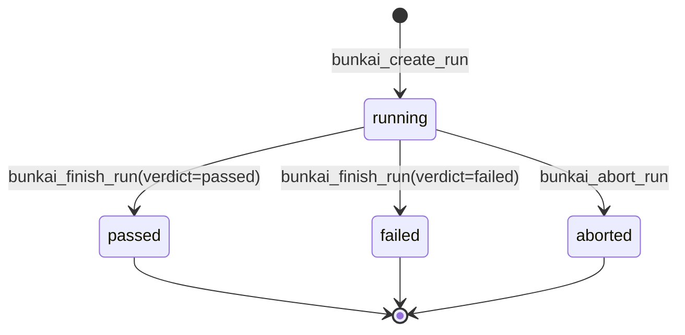
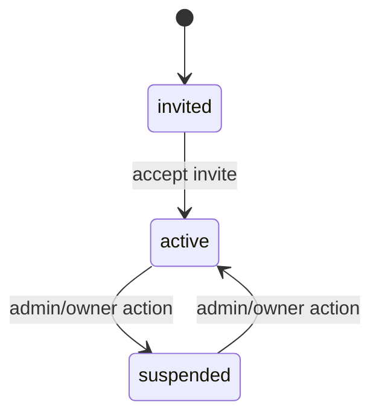

# Bunkai TMS — Domain Glossary

> Generated: 2026-08-14 by `/project-discovery` Phase 1, Sub-step 4.
> Source of truth: `../upex-bunkai-tms/supabase/migrations/0001_tenancy.sql` through `0037_run_finish.sql` (37 migrations at time of discovery — schema/migration files are authoritative per Phase 1 gotcha "prefer schema over ORM models"; no ORM exists in this repo, client access is direct `@supabase/supabase-js` + RPC calls).
> Cross-referenced against this QA repo's `.context/PBI/` synced Jira tickets (BK-23, BK-27, BK-34–39, BK-45, BK-50) which reference these same entities from the product-usage side.

---

## 1. Core Entities

### Workspace

| Technical Name | Business Name | Description | Table/Collection | Key Attributes | Found In |
|---|---|---|---|---|---|
| `workspaces` | Workspace | The multi-tenant root boundary. Every other entity resolves back to a workspace for RLS purposes. | `public.workspaces` | `id`, `slug` (unique), `name`, `owner_user_id`, `plan` (`community`/`cloud`/`enterprise`), `created_at` | `supabase/migrations/0001_tenancy.sql` |

**Relationships**:
- Has many `workspace_members` (RBAC join to `auth.users`)
- Has many `projects`
- Has one `owner_user_id` → `auth.users`

**JSON example**:
```json
{
  "id": "b1c2d3e4-...",
  "slug": "acme-qa",
  "name": "Acme QA",
  "owner_user_id": "u1...",
  "plan": "community",
  "created_at": "2026-05-19T10:00:00Z"
}
```

---

### Project

| Technical Name | Business Name | Description | Table/Collection | Key Attributes | Found In |
|---|---|---|---|---|---|
| `projects` | Project | The application-under-test container, scoped to one Workspace. Groups modules, user stories, ATCs, tests. | `public.projects` | `id`, `workspace_id`, `slug` (unique per workspace), `name`, `description`, `created_at` | `supabase/migrations/0002_projects_modules.sql` |

**Relationships**:
- Belongs to `workspace`
- Has many `modules`
- Has many `atcs` (directly — an ATC belongs to both a project and a module)
- Has many `project_environments` (added in `0031_runs.sql`)

**JSON example**:
```json
{
  "id": "p1...",
  "workspace_id": "b1c2d3e4-...",
  "slug": "checkout-app",
  "name": "Checkout App",
  "description": "Core e-commerce checkout flow",
  "created_at": "2026-05-19T10:05:00Z"
}
```

---

### Module

| Technical Name | Business Name | Description | Table/Collection | Key Attributes | Found In |
|---|---|---|---|---|---|
| `modules` | Module | A self-referential tree node organizing the test suite hierarchically (folders), mirroring the app-under-test's structure. Max depth 6, enforced by a CHECK constraint splitting `path` on `/`. | `public.modules` | `id`, `project_id`, `parent_module_id` (nullable, self-ref), `path` (materialized, slash-separated, unique per project), `name`, `position`, `created_at` | `supabase/migrations/0002_projects_modules.sql`; description + soft-delete added in `0013_module_description.sql` / `0014_module_soft_delete.sql`; move/reparent in `0015_module_move.sql`; activity log in `0023_module_activity_log.sql` |

**Relationships**:
- Belongs to `project`
- Belongs to `parent_module` (self-referential, 0..1)
- Has many `child modules` (self-referential, 0..*)
- Has many `user_stories`
- Has many `atcs` (also belongs to module)

**JSON example**:
```json
{
  "id": "m1...",
  "project_id": "p1...",
  "parent_module_id": null,
  "path": "Payment",
  "name": "Payment",
  "position": 0,
  "created_at": "2026-05-19T10:10:00Z"
}
```

---

### User Story

| Technical Name | Business Name | Description | Table/Collection | Key Attributes | Found In |
|---|---|---|---|---|---|
| `user_stories` | User Story | The unit of business intent, anchored to a Module. Can be imported from an external tracker (Jira). | `public.user_stories` | `id`, `module_id`, `title`, `description`, `external_id`, `external_url`, `created_at`; uniqueness added in `0016_user_story_uniqueness.sql`; `ready_to_test` gate function in `0018_ready_to_test_gate_fn.sql` | `supabase/migrations/0003_authoring.sql`, `0016`, `0018` |

**Relationships**:
- Belongs to `module`
- Has many `acceptance_criteria`
- Has many `atcs` (an ATC references exactly one `user_story_id`, `on delete restrict` — a story cannot be deleted while ATCs still reference it)

**JSON example**:
```json
{
  "id": "us1...",
  "module_id": "m1...",
  "title": "BK-9 — Apply discount code at checkout",
  "description": "As a shopper I want to apply a discount code...",
  "external_id": "BK-9",
  "external_url": "https://upexgalaxy71.atlassian.net/browse/BK-9",
  "created_at": "2026-05-19T10:15:00Z"
}
```

---

### Acceptance Criterion

| Technical Name | Business Name | Description | Table/Collection | Key Attributes | Found In |
|---|---|---|---|---|---|
| `acceptance_criteria` | Acceptance Criterion (AC) | A sortable, verifiable assertion under a User Story. The unit an ATC must anchor to (see ATC below — "anchoring moat"). | `public.acceptance_criteria` | `id`, `user_story_id`, `title`, `description`, `position` (unique per story), `created_at`; ordering refined in `0017_acceptance_criteria_ordering.sql` | `supabase/migrations/0003_authoring.sql`, `0017` |

**Relationships**:
- Belongs to `user_story`
- Has many `atcs` via the M:N join `atc_acceptance_criteria` (an AC can be verified by multiple ATCs, and an ATC can bind to multiple ACs)

**JSON example**:
```json
{
  "id": "ac1...",
  "user_story_id": "us1...",
  "title": "Given a valid code, discount is applied",
  "description": "When the shopper enters a valid, active code, the cart total reflects the discount before payment.",
  "position": 1,
  "created_at": "2026-05-19T10:16:00Z"
}
```

---

### ATC (Acceptance Test Case)

| Technical Name | Business Name | Description | Table/Collection | Key Attributes | Found In |
|---|---|---|---|---|---|
| `atcs` | ATC (Acceptance Test Case) | A reusable, atomic test unit. Structurally anchored to ≥1 Acceptance Criterion via the M:N join — the schema comment calls this "the anchoring moat". Bound to exactly one Project, Module, and User Story. | `public.atcs` | `id`, `project_id`, `module_id`, `user_story_id`, `slug` (unique per project), `title`, `layer` (`UI`\|`API`\|`Unit`), `version`, `status` (`pass`\|`fail`\|`blocked`\|`skipped`\|`running`\|`unrun`), `tags[]`, `tsv` (full-text search vector), `created_at`, `updated_at` | `supabase/migrations/0004_atcs.sql`; RPC create/update in `0007_save_atc.sql` and `0021_atc_create_update.sql`; search in `0027_atc_search.sql`; duplicate in `0028_atc_duplicate.sql`; usage tracking in `0029_atc_usage.sql`; propagation to Tests/Runs on update in `0035_atc_update_propagation.sql` |
| `atc_steps` | ATC Step | An ordered step within an ATC (the executable action). | `public.atc_steps` | `id`, `atc_id`, `position` (unique per ATC), `content`, `input_data`, `expected` | `supabase/migrations/0004_atcs.sql` |
| `atc_assertions` | ATC Assertion | An ordered assertion/expectation attached to an ATC (separate from step-level `expected`). | `public.atc_assertions` | `id`, `atc_id`, `position` (unique per ATC), `content` | `supabase/migrations/0004_atcs.sql` |
| `atc_acceptance_criteria` | ATC↔AC Binding | The M:N join enforcing the anchoring moat. | `public.atc_acceptance_criteria` | `atc_id`, `acceptance_criterion_id` (composite PK) | `supabase/migrations/0004_atcs.sql` |

**Relationships**:
- Belongs to `project`, `module`, `user_story`
- Has many `atc_steps`
- Has many `atc_assertions`
- Has many `acceptance_criteria` (M:N via `atc_acceptance_criteria`) — minimum 1 required (business-rule level, structurally supported by the FK)
- Referenced by `test_steps` (a Test's chain is made of ATC references, `on delete restrict` — an ATC in active use by a Test cannot be deleted)
- Referenced (by snapshot, `on delete set null`, provenance only) by `run_atcs`

**JSON example**:
```json
{
  "id": "atc1...",
  "project_id": "p1...",
  "module_id": "m1...",
  "user_story_id": "us1...",
  "slug": "apply-valid-discount-code",
  "title": "Apply valid discount code at checkout",
  "layer": "UI",
  "version": 1,
  "status": "pass",
  "tags": ["checkout", "discount"],
  "created_at": "2026-05-19T10:20:00Z",
  "updated_at": "2026-06-01T09:00:00Z"
}
```

---

### Test

| Technical Name | Business Name | Description | Table/Collection | Key Attributes | Found In |
|---|---|---|---|---|---|
| `tests` | Test | A named, ordered chain of ATC *references* (not copies — a Test binds to the live ATC, snapshots only happen at Run time). Workspace-scoped (not project-scoped, unlike ATCs). | `public.tests` | `id`, `workspace_id`, `title` (trimmed, 1–200 chars), `created_by`, `created_at`, `updated_at` | `supabase/migrations/0024_tests.sql` (BK-27); read composer in `0025_test_read.sql`; reorder in `0026_tests_reorder.sql`; tags in `0030_test_tags.sql` |
| `test_steps` | Test Step (chain link) | One position in a Test's ordered ATC chain. Surrogate PK because the same `atc_id` may legally repeat at multiple positions within one chain. | `public.test_steps` | `id`, `test_id`, `atc_id` (`on delete restrict`), `position` (≥1, unique per test) | `supabase/migrations/0024_tests.sql` |

**Relationships**:
- Belongs to `workspace`
- Has many `test_steps`, each referencing one `atc`
- Has many `runs` (a Test can be executed multiple times, producing a Run each time)

**Note (Terminology)**: "Test" (capitalized in schema comments) is distinct from "ATC" — a Test is an assembled *chain* of ATCs, not a single test case itself. Do not conflate "Test" with the generic QA term "test case"; in this domain that role is played by ATC.

**JSON example**:
```json
{
  "id": "t1...",
  "workspace_id": "b1c2d3e4-...",
  "title": "Checkout — happy path with discount",
  "created_by": "u1...",
  "created_at": "2026-06-12T10:00:00Z",
  "steps": [
    { "position": 1, "atc_id": "atc1..." },
    { "position": 2, "atc_id": "atc2..." }
  ]
}
```

---

### Run

| Technical Name | Business Name | Description | Table/Collection | Key Attributes | Found In |
|---|---|---|---|---|---|
| `runs` | Run (Test Execution) | One execution of a Test against a target `project_environments` row. Snapshots the Test's ATC chain and every step's content *at start time*, so later edits to the source ATC never retroactively alter what a completed Run recorded. | `public.runs` | `id`, `workspace_id`, `project_id`, `test_id` (`on delete restrict`), `environment_id`, `status` (`running`\|`passed`\|`failed`\|`aborted`), `executor_mode` (`human`\|`agent`\|`ci`), `executor_user_id`, `start_token`, `test_title` (snapshot), `version` (optimistic lock), `started_at`, `finished_at` | `supabase/migrations/0031_runs.sql` (BK-34); abort in `0036_run_abort.sql` (BK-36); finish/verdict in `0037_run_finish.sql` (BK-39) |
| `run_atcs` | Run ATC (chain snapshot) | A frozen snapshot of one chain position at Run-start time. | `public.run_atcs` | `id`, `run_id`, `atc_id` (`on delete set null`, provenance only), `position` (unique per run), `atc_title` (snapshot), `status` (`pending`\|`passed`\|`failed`\|`blocked`\|`skipped`) | `supabase/migrations/0031_runs.sql` |
| `run_steps` | Run Step (executable-step snapshot) | A frozen snapshot of one ATC step at Run-start time, including its execution result. | `public.run_steps` | `id`, `run_atc_id`, `atc_step_id` (`on delete set null`, provenance only), `position`, `content`/`input_data`/`expected` (all snapshots), `status`, `note`, `evidence_url`, `executed_at` | `supabase/migrations/0031_runs.sql` |
| `project_environments` | Environment | The target an Environment a Run executes against (e.g. Staging, Production), scoped to a Project. Seeded "Staging" + "Production" per project by migration; no client write endpoint yet (MVP). | `public.project_environments` | `id`, `project_id`, `name` (1–60 chars, case-insensitive unique per project), `created_at` | `supabase/migrations/0031_runs.sql`; CRUD added in `0032_project_environments_crud.sql` |

**Relationships**:
- Belongs to `test`, `project` (via `test`'s chain), `workspace`, `environment` (`project_environments`)
- Has many `run_atcs`, each has many `run_steps`
- Has 0..1 `executor_user_id` → `auth.users` (nullable — an `agent`/`ci` executor may not be a human user)

**JSON example**: see `bunkai_run_json` composed output in `supabase/migrations/0031_runs.sql` lines 217–281 (header + nested `atcs[]` → `steps[]`).

---

## 2. Enumerations and Constants

| Value | Business Meaning | Usage Context |
|---|---|---|
| `plan`: `community`, `cloud`, `enterprise` | Workspace billing tier (field exists, billing not yet wired) | `workspaces.plan` — `supabase/migrations/0001_tenancy.sql` |
| `role`: `viewer`, `member`, `admin`, `owner` | RBAC role within a workspace, ascending privilege | `workspace_members.role` — `supabase/migrations/0001_tenancy.sql` |
| `status` (membership): `active`, `invited`, `suspended` | Membership lifecycle | `workspace_members.status` — `supabase/migrations/0001_tenancy.sql` |
| `layer`: `UI`, `API`, `Unit` | Which testing layer an ATC exercises | `atcs.layer` — `supabase/migrations/0004_atcs.sql` |
| `status` (ATC): `pass`, `fail`, `blocked`, `skipped`, `running`, `unrun` | Last-known verdict of an ATC as a standalone unit | `atcs.status` — `supabase/migrations/0004_atcs.sql` |
| `status` (user_stories via RPC): `draft`, `ready_to_test` | Story readiness gate | `bunkai_*` ready-to-test function — `supabase/migrations/0018_ready_to_test_gate_fn.sql` |
| `status` (import_jobs): `queued`, `running`, `completed`, `failed` | Async Jira import job lifecycle | `import_jobs.status` — `supabase/migrations/0019_import_jobs.sql` |
| `status` (run_atcs / run_steps): `pending`, `passed`, `failed`, `blocked`, `skipped` | Per-chain-position / per-step execution verdict within a Run | `run_atcs.status`, `run_steps.status` — `supabase/migrations/0031_runs.sql` |
| `status` (runs): `running`, `passed`, `failed`, `aborted` | Overall Run verdict | `runs.status` — `supabase/migrations/0031_runs.sql`; `aborted` added by `0036_run_abort.sql`, `passed`/`failed` finalized by `0037_run_finish.sql` |
| `executor_mode`: `human`, `agent`, `ci` | Who/what is driving a Run | `runs.executor_mode` — `supabase/migrations/0031_runs.sql` |
| `status` (idempotency_keys): `pending`, `succeeded`, `failed` | POST replay-protection record state | `idempotency_keys.status` — `supabase/migrations/0009_cross_cutting.sql` |
| `scope` (feature_flags): `global`, `workspace` | Flag rollout scope | `feature_flags.scope` — `supabase/migrations/0009_cross_cutting.sql` |
| Custom SQLSTATE codes (e.g. `42501` forbidden, `45120` chain_empty, `45121` title_invalid, `45122` atc_not_in_workspace, `45200`–`45207` run-domain errors) | Structured, documented RPC error contract — NOT generic Postgres errors, deliberate business-rule signaling | Throughout `bunkai_*` RPC functions, e.g. `supabase/migrations/0024_tests.sql`, `0031_runs.sql`, `0037_run_finish.sql` |

---

## 3. Business Rules

### Rule: ATC Anchoring Moat
- **Description**: An ATC must be bound to at least one Acceptance Criterion via `atc_acceptance_criteria`.
- **Entities Affected**: `atcs`, `acceptance_criteria`, `atc_acceptance_criteria`
- **Validation**: FK structure supports the binding; the ≥1 minimum is enforced at the application/RPC layer per the migration comment ("enforced at the application layer in MVP, made structural by FK").
- **Error Message**: not directly observed in migrations (application-layer concern) — flagged as Discovery Gap below.
- **Found In**: `supabase/migrations/0004_atcs.sql`, lines 1–6
- **Given/When/Then example**: Given a new ATC with zero AC bindings, When the author attempts to save it, Then the save should be rejected (application-layer rule; exact error surface not confirmed in this pass).

### Rule: Test Chain Must Contain ≥1 ATC
- **Description**: `bunkai_create_test` rejects an empty `p_atc_ids` array.
- **Entities Affected**: `tests`, `test_steps`, `atcs`
- **Validation**: `coalesce(array_length(p_atc_ids, 1), 0) < 1` → raise
- **Error Message / Code**: `chain_empty`, SQLSTATE `45120`
- **Found In**: `supabase/migrations/0024_tests.sql`, lines 203–206
- **Given/When/Then**: Given a request to create a Test with an empty ATC array, When `bunkai_create_test` runs, Then it raises `45120 chain_empty` before any row is inserted.

### Rule: ATCs in a Test Chain Must Resolve Inside the Caller's Workspace (INV-3 non-disclosure)
- **Description**: Every distinct ATC id in a Test's chain must be a non-archived ATC belonging to a project inside the target workspace. Foreign-workspace and nonexistent ids collapse into ONE uniform error with no id echoed back, to avoid leaking existence of other workspaces' data.
- **Entities Affected**: `tests`, `atcs`, `projects`, `workspaces`
- **Validation**: resolved-count vs distinct-count comparison in `bunkai_create_test`
- **Error Message / Code**: `atc_not_in_workspace`, SQLSTATE `45122`
- **Found In**: `supabase/migrations/0024_tests.sql`, lines 208–225
- **Given/When/Then**: Given a Test-create request containing an ATC id from a different workspace, When the RPC runs, Then it raises `45122` without revealing whether the id exists elsewhere.

### Rule: Run Snapshot Immutability
- **Description**: A Run's `run_atcs`/`run_steps` are copied at start time; subsequent edits to the source `atcs`/`atc_steps` never retroactively change a completed Run's recorded content.
- **Entities Affected**: `runs`, `run_atcs`, `run_steps`, `atcs`, `atc_steps`
- **Validation**: structural — `atc_id`/`atc_step_id` FKs are `on delete set null` (provenance only), all content columns on `run_atcs`/`run_steps` are independent copies, not references
- **Error Message**: n/a (this is a positive-design guarantee, not a rejected-input rule)
- **Found In**: `supabase/migrations/0031_runs.sql`, lines 117–179; reaffirmed by the propagation-avoidance comment in `0035_atc_update_propagation.sql`
- **Given/When/Then**: Given a Run has completed with step content "Click Pay", When the source ATC's step is later edited to "Click Pay Now", Then the completed Run's `run_steps.content` still reads "Click Pay".

### Rule: A Run Can Only Be Finished/Aborted Once (First-Terminal-Action Wins)
- **Description**: Only a Run in `running` status can transition to `passed`/`failed` (finish) or `aborted` (abort); a concurrent second attempt loses under a row lock and gets a "not finishable"/"not abortable" error — modeled as a 409 at the HTTP layer.
- **Entities Affected**: `runs`
- **Validation**: `FOR UPDATE` row lock + status re-check inside `bunkai_finish_run` / `bunkai_abort_run`
- **Error Message / Code**: `run_not_finishable`, SQLSTATE `45206` (finish path); sibling code exists for abort in `0036_run_abort.sql` (not read in this pass — see Discovery Gaps)
- **Found In**: `supabase/migrations/0037_run_finish.sql`, lines 39–43
- **Given/When/Then**: Given a Run already marked `passed`, When a second finish request arrives for the same Run, Then it is rejected with `45206 run_not_finishable`.

---

## 4. Entity Relationships Diagram



---

## 5. Terminology Mapping

### Technical → Business terms

| Technical (code/table) | Business term | Notes |
|---|---|---|
| `workspaces` | Workspace | Multi-tenant org boundary |
| `projects` | Project | App-under-test container |
| `modules` | Module | Test-suite folder / tree node |
| `user_stories` | User Story | Requirement unit |
| `acceptance_criteria` | Acceptance Criterion / AC | Verifiable requirement clause |
| `atcs` | ATC / Acceptance Test Case | Reusable atomic test unit — NOT the same as "Test" below |
| `tests` | Test | An assembled, ordered chain of ATC references |
| `runs` | Run / Test Execution | One execution instance of a Test |
| `run_atcs` / `run_steps` | (Run) Snapshot rows | Frozen copies, not live references |
| `project_environments` | Environment | Deployment target a Run executes against (e.g. Staging) |
| `access_tokens` | Personal Access Token (PAT) | Headless/CI auth credential, prefix `bk_pat_` |
| `activity_log` | Audit Log | Cross-cutting event trail written by SECURITY DEFINER RPCs only |

### Abbreviations and acronyms

| Abbreviation | Meaning |
|---|---|
| ATC | Acceptance Test Case |
| AC | Acceptance Criterion |
| RLS | Row Level Security (Postgres/Supabase) |
| RPC | Remote Procedure Call — here, a Postgres `SECURITY DEFINER` function invoked via `supabase-js` |
| PAT | Personal Access Token |
| TMS | Test Management System (the product category Bunkai belongs to) |
| MVP | Minimum Viable Product |
| INV-3 | An internally-numbered invariant referenced in RPC comments (non-disclosure of foreign-workspace resource existence) — numbering scheme for INV-1/INV-2 not found in the migrations read this pass (Discovery Gap) |

---

## 6. Status / State Flows

### ATC status

Source: `atcs.status` CHECK constraint, `supabase/migrations/0004_atcs.sql`. Transition triggers (what UI/API action causes each edge) not directly observed in the migrations — schema only proves the valid state *set*, not the transition graph; edges above are the reasonable default (an ATC re-enters `running` on any re-run) and should be confirmed against the actual API handlers before being treated as verified.

### Run status

Source: `supabase/migrations/0031_runs.sql` (create), `0037_run_finish.sql` (finish, verified), `0036_run_abort.sql` (abort — referenced by name in `0037`'s header comment but not independently read this pass, see Discovery Gaps). Terminal states (`passed`/`failed`/`aborted`) are confirmed one-way: `bunkai_finish_run`'s gate explicitly rejects finishing an already-closed Run (SQLSTATE `45206`), meaning there is no observed transition back out of a terminal state.

### Workspace membership status

Source: `workspace_members.status` CHECK constraint (`active`, `invited`, `suspended`), `supabase/migrations/0001_tenancy.sql`; invite-accept flow confirmed in `business-feature-map.md` §2.3. Exact transition triggers for `suspended` not directly observed (no suspend endpoint found in the route tree this pass) — treat as inferred, not verified.

---

## 7. UI Labels Reference

No i18n/locale files were found in the target repo (`app/**` was scanned for a `locales/` directory; none exists). UI labels are therefore hardcoded in component JSX rather than sourced from a translation bundle — this reverses the usual Phase 1 preference ("pull UI labels from i18n files when they exist") since no such file exists here.

| Form field (component-observed, not independently re-verified this pass) | Backing column |
|---|---|
| Workspace name / slug | `workspaces.name` / `.slug` |
| Project name / slug / description | `projects.name` / `.slug` / `.description` |
| Module name | `modules.name` |
| Story title / description | `user_stories.title` / `.description` |
| AC title / description | `acceptance_criteria.title` / `.description` |
| ATC title / layer / tags | `atcs.title` / `.layer` / `.tags` |
| Test title | `tests.title` |
| Run environment | `project_environments.name` |

**Discovery Gap**: exact button/action label strings were not enumerated (would require reading every component file under `components/` and `app/**/*.tsx`, out of scope for a schema-driven Phase 1 pass) — this table lists field labels inferable from the schema + `business-feature-map.md`, not a verbatim UI-copy audit.

---

## 8. Discovery Gaps

- Exact application-layer error message text for the ATC anchoring-moat rejection ("must have ≥1 AC") was not located — the invariant is enforced at the application layer per the migration comment, not in a migration-visible RPC.
- `INV-1` / `INV-2` invariant numbers are referenced implicitly by the existence of `INV-3` in `0024_tests.sql` comments, but their definitions were not found in the migrations read this pass — likely documented in `.context/SRS/architecture-specs.md` inside the target repo (referenced by `supabase/migrations/0001_tenancy.sql` line 9), which was not opened this session.
- `0036_run_abort.sql` (the abort-Run migration) was referenced by name but not independently read — its exact SQLSTATE codes (`45204`/`45205`, per `0037`'s header comment) are inferred, not directly confirmed.
- ATC status transition triggers (what UI/API action causes `unrun → running`, etc.) — only the valid state *set* is schema-confirmed; the transition graph is inferred.
- Workspace-membership `suspended` transition trigger — no suspend endpoint found in the route tree this pass.
- UI label / button copy — not exhaustively audited (no i18n bundle exists to source from; would require a full component-tree read).
- No `defects`/`bugs` table exists anywhere in the 37 migrations — Defect Management is a Bunkai product feature that does not yet exist (tracked as a business-model gap too, see `business-model.md` §3).

---

## 9. QA Usage Guide

Future test-case authors working in this QA repo (`/sprint-testing`, `/test-automation`, `/test-documentation`) should:

1. Use the **Technical → Business terms** table (§5) to translate between Jira ticket language (which may say "Test Case") and the actual schema entity (ATC vs. Test — these are NOT synonyms in this domain; conflating them will misname fixtures/components).
2. When designing test cases for anything touching Runs, deliberately test the **snapshot-immutability rule** (§3) — a common regression class in systems with a source/snapshot split is accidental live-reference leakage.
3. When designing test cases for Test/Run creation endpoints, use the **custom SQLSTATE table** (§2) to assert on the specific error code returned, not just a generic 4xx/5xx — this codebase treats these codes as a deliberate, stable API contract.
4. Any workspace-scoped test plan MUST include a cross-tenant isolation case (workspace A cannot read/write workspace B's rows) given the RLS-everywhere design — this is a structural risk surface, not a one-off edge case.
5. Treat the state diagrams in §6 as **inferred, not verified** where marked — confirm the actual transition trigger (which endpoint/action fires it) against the live API before writing a State-Transition test matrix based on them.
