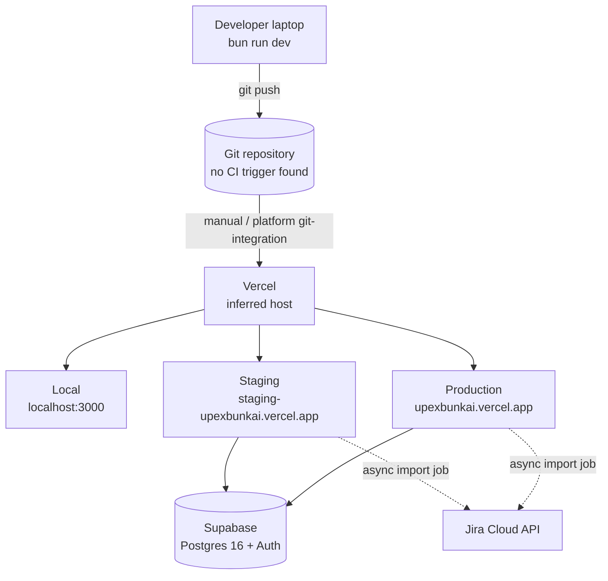
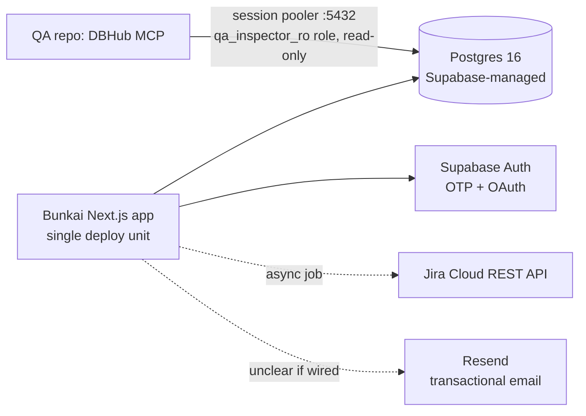

# Bunkai TMS — Infrastructure Mapping

> Generated: 2026-08-14 by `/project-discovery` Phase 3 (Infrastructure Discovery).
> Method: reverse-engineered from `../upex-bunkai-tms` — checked for `.github/`, `Dockerfile`, `docker-compose.yml`, `vercel.json`, `*.tf`, `.gitlab-ci.yml` at repo root; none found except what's listed below. Target repo read-only.
> **Discrepancy notice**: if the target repo's own `.context/` carries an infrastructure/deployment doc describing CI/CD pipelines, monitoring (Sentry/PostHog), or IaC, treat it as aspirational per the same caution Phase 2 applied to `architecture-specs.md` — no such evidence was found in the actual repo tree during this pass. Everything below reflects only what is verifiable from real files.

---

## Overview Diagram

## CI/CD Configuration

**Platform: none.** No `.github/workflows/`, `.gitlab-ci.yml`, `azure-pipelines.yml`, `.circleci/config.yml`, or `Jenkinsfile` exists anywhere in the target repo. Confirmed by direct directory check at repo root — this matches what Phase 1 (`project-config.md`) already recorded.

The closest thing to a CI gate is the manually-invoked `bun run repo:check` script (`format:check && lint:check && types:check && vars:check && vars:env:check && skills:check && skills:registry:check`) — nothing triggers it automatically on push or PR.

**QA implication**: regression suites run against `staging-upexbunkai.vercel.app` must be triggered manually or from THIS QA repo's own CI (if any) — there is no target-repo pipeline to hook into or extend.

## Deployment Configuration

| Item | Value | Confidence |
|---|---|---|
| Hosting platform | Vercel | Inferred — `*.vercel.app` domain convention, `VERCEL_ENV` read in code (confirmed via `grep -rhoE "process\.env\.[A-Z_0-9]+"`), `POSTGRES_*` env-var shape typical of the Vercel+Supabase marketplace integration. **No `vercel.json` file exists** to confirm project-level Vercel config directly. |
| Deployment method | Presumed platform git-integration (push-to-deploy) | Not independently confirmed — no CI workflow triggers a deploy, so it must be either Vercel's native git integration or a manual `vercel deploy` |
| Docker | Not used | No `Dockerfile` or `docker-compose.yml` found — consistent with a Vercel-native deploy (no red flag per Phase 3 doctrine: "missing Dockerfile is not a red flag when the platform is Vercel/Netlify/Fly") |
| Preview environments | Not confirmed | Standard Vercel behavior would generate a preview URL per PR, but with no CI/git-integration config visible in-repo, this cannot be verified from code alone |

## Environments Matrix

| Environment | URL | Branch | Auto Deploy | Approval |
|---|---|---|---|---|
| Local | `http://localhost:3000` | — | — | — |
| Staging | `https://staging-upexbunkai.vercel.app` | Not verified (no branch-to-env mapping found in-repo) | Unconfirmed | Unconfirmed |
| Production | `https://upexbunkai.vercel.app` | Not verified | Unconfirmed | Unconfirmed |

URLs are carried over from this QA repo's `.agents/project.yaml` (already the established source of truth per Phase 1) — not independently re-derived from a target-repo config file, since none exists (`vercel.json` absent). **Never test against Production** — explicit team rule (Ely), already recorded in this QA repo's persistent memory.

## Environment Variables by Environment

Not independently determinable from the target repo — env values live in the Vercel dashboard / Supabase project settings per environment, not in any committed file. See `backend.md` §Environment Variables for the full var catalog (names only, no values) and the Required/Optional/External-Service classification.

## Secrets Management

| Secret category | Storage mechanism | Evidence |
|---|---|---|
| Supabase keys (`NEXT_PUBLIC_SUPABASE_ANON_KEY`, `SUPABASE_SERVICE_ROLE_KEY`, `SUPABASE_JWT_SECRET`) | Vercel project env vars (per-environment), sourced from Supabase Dashboard | `.env.example` instructs copying from Vercel Storage → Supabase store → Quickstart snippet |
| Atlassian credentials | `.env` (git-ignored), local/CI-only | `.env.example` `ATLASSIAN_*` block |
| PAT secrets (application-level, not infra) | SHA-256 hash in `access_token_secrets` table, isolated from `access_tokens` | `.context/SRS/architecture.md` §Data Protection |
| DB QA read-only credentials | DBHub MCP config (`dbhub.toml`), values resolved from `.env` at MCP spawn time | target repo `dbhub.toml` — explicitly notes real passwords live in a Jira credentials Epic (BK-29), never in the file |

No secrets-manager (Vault, AWS Secrets Manager, Doppler, 1Password CLI) integration found in dependencies or config.

## Cloud Services

| Service | Provider | Purpose |
|---|---|---|
| Hosting | Vercel (inferred) | App hosting, presumed CI-less deploy |
| Database + Auth | Supabase | Postgres 16 (RLS), OTP/OAuth session issuance |
| Email (unclear if wired) | Resend | `RESEND_API_KEY` present; business-feature-map notes invite emails not sent in MVP — likely unused |
| Issue tracker (dev workflow, not product runtime) | Jira Cloud | Target repo runs its own Jira sync scripts for ITS OWN development workflow (same boilerplate family as this QA repo) — unrelated to the Bunkai product's Jira-import feature, which is a product feature (`lib/jira/import-runner.ts`) |

## Database Infrastructure

| Item | Value |
|---|---|
| Provider | Supabase (managed Postgres) |
| Type | PostgreSQL, RLS-first |
| Region | Not found in-repo — Discovery Gap |
| Backups | Not found in-repo — Supabase-platform default, not independently confirmed |
| Connection (QA) | Session pooler, port 5432, `qa_inspector_ro.<project-ref>` read-only role, `sslmode=require` — per `dbhub.toml` |
| Connection (app) | `@supabase/supabase-js` client — connection details resolved from `NEXT_PUBLIC_SUPABASE_URL` + keys, not a direct Postgres connection string in app code |

## Infrastructure Resources Diagram

## IaC

**None found.** No `*.tf`, `Pulumi.yaml`, `cdk.json`, `serverless.yml`, `k8s/`, `kubernetes/`, or `helm/` directory in the target repo. Infrastructure is presumed to be manually configured through the Vercel and Supabase dashboards.

## Monitoring & Observability

**Not implemented** — no Sentry, DataDog, Rollbar, Bugsnag, PostHog, UptimeRobot, Pingdom, or BetterStack dependency found in `package.json`. This matches Phase 2's NFR discovery ("Monitoring: Not implemented"). The target repo's own aspirational SRS mentions Sentry/PostHog/Redis/BullMQ, but none of these appear in the actual dependency tree — treat that as a forward-looking plan, not current state (same discrepancy Phase 2 already flagged for `architecture-specs.md`).

## Deployment Checklist

**Not found as a committed document or script** — no `DEPLOYMENT.md`, deploy runbook, or pre/post-deploy script located in this pass. Discovery Gap.

Rollback mechanism: **not independently confirmed in-repo** (no `vercel.json`, no rollback script). If hosting is genuinely Vercel with git-integration as inferred, Vercel's native "promote a previous deployment" / `vercel rollback` capability would be the presumed mechanism — flagged as inference, not evidence, since no Vercel CLI config or workflow references it.

## Discovery Gaps

- Hosting platform (Vercel) is inferred from domain convention + `VERCEL_ENV` env-var read in code — no `vercel.json` or platform-specific config file exists to confirm project settings, build command overrides, or region.
- Deployment trigger mechanism (git-integration vs. manual `vercel deploy`) not confirmed — no CI workflow exists to observe.
- Branch-to-environment mapping (e.g., does `main` deploy to staging or production?) not found in any committed file.
- Preview-deployment behavior per PR not confirmed.
- Database region, backup cadence, and connection-pool sizing not found in-repo — Supabase-dashboard-only configuration, out of reach of a code-only discovery pass.
- Rollback procedure is an inference (Vercel's native rollback), not a documented/verified runbook.
- No deployment checklist or runbook document found in the target repo.

## QA Relevance

- **No CI/CD to integrate with.** Regression suites (`/regression-testing`) must trigger from THIS QA repo's own pipeline (if any exists) or be run manually — there is nothing in the target repo to hook a "run tests on deploy" step into.
- **Staging is the only safe automated-test target** (`https://staging-upexbunkai.vercel.app`) — Production is explicitly off-limits per team rule. Local (`http://localhost:3000`) requires a local Supabase project or a shared dev Supabase instance, neither confirmed reachable this pass.
- **DB access for QA** goes through DBHub MCP → Supabase session pooler (port 5432) with a read-only role — write-path verification during testing must go through the app's API/RPC layer, not direct DB writes (the read-only role structurally prevents it, which is itself a useful test-isolation guarantee).
- **No health-check endpoint** exists to gate "is staging up" checks before a test run — a smoke test hitting `/login` (or any public page) is the practical substitute until one exists.
